

Universidad Peruana de Ciencias Aplicadas

Carrera de Ingeniería de Software

**1ASI0729** 

**Desarrollo de Aplicaciones Open Source**

NRC 

**7747**

**Informe del AV1**

Docente:
**Robles Fernández, Ivan**

 

Equipo:

**DataBit**

Proyecto:

**StockIA**

 

**Integrantes:**

| Código | Apellidos y Nombres |
|---|---|
| U202414970 | Gallardo Morales, Carla Alejandra|
| U20231H067 | Huaman Oscco, Aldo Jesus |
| U202411261 | Miranda Cordova, Jesus Angel Yvan |
| U202415088 | Ortiz Laura, Leyla Alisson |
| U20241E367 | Toro Turpo, Ronal |

 

**Periodo 202620**

**Septiembre, 2026**

---

# Registro de Versiones del Informe

<table>
  <tr>
    <th>Versión</th>
    <th>Fecha</th>
    <th>Autor</th>
    <th>Descripción de modificación</th>
  </tr>

  <tr>
    <td><b>Primera Entrega (AV1)</b></td>
    <td>XX/09/2026</td>
    <td>
      Gallardo Morales,Carla Alejandra  
       
      

      Huaman Oscco, Aldo Jesus  
       
      

      Miranda Cordova, Jesus Angel Yvan  
       
      

      Ortiz Laura, Leyla Alisson  
       
      

      Toro Turpo, Ronal  
    </td>
    <td>
      Capítulo I: 
      Introducción
     
      Capítulo II:
      Requirements Elicitation & Analysis
      
      Capítulo III: 
      Requirements Specification
     
      Capítulo IV:
        Product Design
     
      Capítulo V:
      Product Implementation, Validation & Deployment
     
    </td>
  </tr>
  </table>

 ---
 # Project Report Collaboration Insights

URL del repositorio (report): https://github.com/upc-pre-202602-1ASI0729-7747-databit 

**Primera Entrega (AV1)**

---
# Student Outcome

El curso contribuye al cumplimiento del Student Outcome ABET:

**ABET – EAC - Student Outcome 3**

**Criterio:** 
*Capacidad de comunicarse efectivamente con un rango de audiencias.*

En el siguiente cuadro se describe las acciones realizadas y enunciados de
conclusiones por parte del grupo, que permiten sustentar el haber alcanzado el logro
del ABET – EAC - Student Outcome 3.

<table>
  <tr>
    <th>Criterio específico</th>
    <th>Acciones realizadas</th>
    <th>Conclusiones</th>
  </tr>
  <tr>
      <td><b>Comunica oralmente con efectividad a diferentes rangos de audiencia.</b></td>
      <td>
            <b>Gallardo Morales, Carla Alejandra</b> 
            <u>AV1</u> 
              
            <b>Huaman Oscco, Aldo Jesus</b> 
            <u>AV1</u> 
              
            <b>Miranda Cordova, Jesus Angel Yvan</b> 
            <u>AV1</u> 
              
            <b>Ortiz Laura, Leyla Alisson</b> 
            <u>AV1</u> 
              
            <b>Toro Turpo, Ronal</b> 
            <u>AV1</u> 
              
        </td>
        <td>
            <u>AV1</u> 
        </td>
    </tr>
      <tr>
      <td><b>Comunica por escrito con efectividad a diferentes rangos de audiencia</b></td>
      <td>
            <b>Gallardo Morales, Carla Alejandra</b> 
            <u>AV1</u> 
              
            <b>Huaman Oscco, Aldo Jesus</b> 
            <u>AV1</u> 
              
            <b>Miranda Cordova, Jesus Angel Yvan</b> 
            <u>AV1</u> 
              
            <b>Ortiz Laura, Leyla Alisson</b> 
            <u>AV1</u> 
              
            <b>Toro Turpo, Ronal</b> 
            <u>AV1</u> 
              
        </td>
        <td>
            <u>AV1</u> 
        </td>
    </tr>
</table>

---
# Contenido

# Tabla de Contenidos

- [Capítulo I: Introducción](#capítulo-i-introducción)
  - [1.1. Startup Profile](#11-startup-profile)
    - [1.1.1. Descripción de la Startup](#111-descripción-de-la-startup)
    - [1.1.2. Perfiles de integrantes del equipo](#112-perfiles-de-integrantes-del-equipo)
  - [1.2. Solution Profile](#12-solution-profile)
    - [1.2.1. Antecedentes y problemática](#121-antecedentes-y-problemática)
    - [1.2.2. Lean UX Process](#122-lean-ux-process)
      - [1.2.2.1. Lean UX Problem Statements](#1221-lean-ux-problem-statements)
      - [1.2.2.2. Lean UX Assumptions](#1222-lean-ux-assumptions)
      - [1.2.2.3. Lean UX Hypothesis Statements](#1223-lean-ux-hypothesis-statements)
      - [1.2.2.4. Lean UX Canvas](#1224-lean-ux-canvas)
  - [1.3. Segmentos objetivo](#13-segmentos-objetivo)

- [Capítulo II: Requirements Elicitation & Analysis](#capítulo-ii-requirements-elicitation--analysis)
  - [2.1. Competidores](#21-competidores)
    - [2.1.1. Análisis competitivo](#211-análisis-competitivo)
    - [2.1.2. Estrategias y tácticas frente a competidores](#212-estrategias-y-tácticas-frente-a-competidores)
  - [2.2. Entrevistas](#22-entrevistas)
    - [2.2.1. Diseño de entrevistas](#221-diseño-de-entrevistas)
    - [2.2.2. Registro de entrevistas](#222-registro-de-entrevistas)
    - [2.2.3. Análisis de entrevistas](#223-análisis-de-entrevistas)
  - [2.3. Needfinding](#23-needfinding)
    - [2.3.1. User Personas](#231-user-personas)
    - [2.3.2. User Task Matrix](#232-user-task-matrix)
    - [2.3.3. User Journey Mapping](#233-user-journey-mapping)
    - [2.3.4. Empathy Mapping](#234-empathy-mapping)
  - [2.4. Big Picture Event Storming](#24-big-picture-event-storming)
  - [2.5. Ubiquitous Language](#25-ubiquitous-language)

- [Capítulo III: Requirements Specification](#capítulo-iii-requirements-specification)
  - [3.1. User Stories](#31-user-stories)
  - [3.2. Impact Mapping](#32-impact-mapping)
  - [3.3. Product Backlog](#33-product-backlog)

- [Capítulo IV: Product Design](#capítulo-iv-product-design)
  - [4.1. Style Guidelines](#41-style-guidelines)
    - [4.1.1. General Style Guidelines](#411-general-style-guidelines)
    - [4.1.2. Web Style Guidelines](#412-web-style-guidelines)
  - [4.2. Information Architecture](#42-information-architecture)
    - [4.2.1. Organization Systems](#421-organization-systems)
    - [4.2.2. Labeling Systems](#422-labeling-systems)
    - [4.2.3. SEO Tags and Meta Tags](#423-seo-tags-and-meta-tags)
    - [4.2.4. Searching Systems](#424-searching-systems)
    - [4.2.5. Navigation Systems](#425-navigation-systems)
  - [4.3. Landing Page UI Design](#43-landing-page-ui-design)
    - [4.3.1. Landing Page Wireframe](#431-landing-page-wireframe)
    - [4.3.2. Landing Page Mock-up](#432-landing-page-mock-up)
  - [4.4. Web Applications UX/UI Design](#44-web-applications-uxui-design)
    - [4.4.1. Web Applications Wireframes](#441-web-applications-wireframes)
    - [4.4.2. Web Applications Wireflow Diagrams](#442-web-applications-wireflow-diagrams)
    - [4.4.3. Web Applications Mock-ups](#443-web-applications-mock-ups)
    - [4.4.4. Web Applications User Flow Diagrams](#444-web-applications-user-flow-diagrams)
  - [4.5. Web Applications Prototyping](#45-web-applications-prototyping)
  - [4.6. Domain-Driven Software Architecture](#46-domain-driven-software-architecture)
    - [4.6.1. Design-Level Event Storming](#461-design-level-event-storming)
    - [4.6.2. Software Architecture Context Diagram](#462-software-architecture-context-diagram)
    - [4.6.3. Software Architecture Container Diagrams](#463-software-architecture-container-diagrams)
    - [4.6.4. Software Architecture Components Diagrams](#464-software-architecture-components-diagrams)
  - [4.7. Software Object-Oriented Design](#47-software-object-oriented-design)
    - [4.7.1. Class Diagrams](#471-class-diagrams)
  - [4.8. Database Design](#48-database-design)
    - [4.8.1. Database Diagrams](#481-database-diagrams)

- [Capítulo V: Product Implementation, Validation & Deployment](#capítulo-v-product-implementation-validation--deployment)
  - [5.1. Software Configuration Management](#51-software-configuration-management)
    - [5.1.1. Software Development Environment Configuration](#511-software-development-environment-configuration)
    - [5.1.2. Source Code Management](#512-source-code-management)
    - [5.1.3. Source Code Style Guide & Conventions](#513-source-code-style-guide--conventions)
    - [5.1.4. Software Deployment Configuration](#514-software-deployment-configuration)
  - [5.2. Landing Page, Services & Applications Implementation](#52-landing-page-services--applications-implementation)
    - [5.2.X. Sprint N](#52x-sprint-n)
      - [5.2.X.1. Sprint Planning N](#52x1-sprint-planning-n)
      - [5.2.X.2. Aspect Leaders and Collaborators](#52x2-aspect-leaders-and-collaborators)
      - [5.2.X.3. Sprint Backlog N](#52x3-sprint-backlog-n)
      - [5.2.X.4. Development Evidence for Sprint Review](#52x4-development-evidence-for-sprint-review)
      - [5.2.X.5. Execution Evidence for Sprint Review](#52x5-execution-evidence-for-sprint-review)
      - [5.2.X.6. Services Documentation Evidence for Sprint Review](#52x6-services-documentation-evidence-for-sprint-review)
      - [5.2.X.7. Software Deployment Evidence for Sprint Review](#52x7-software-deployment-evidence-for-sprint-review)
      - [5.2.X.8. Team Collaboration Insights during Sprint](#52x8-team-collaboration-insights-during-sprint)
  - [5.3. Validation Interviews](#53-validation-interviews)
    - [5.3.1. Diseño de Entrevistas](#531-diseño-de-entrevistas)
    - [5.3.2. Registro de Entrevistas](#532-registro-de-entrevistas)
    - [5.3.3. Evaluaciones según heurísticas](#533-evaluaciones-según-heurísticas)
  - [5.4. Video About-the-Product](#54-video-about-the-product)

- [Conclusiones](#conclusiones)
- [Conclusiones y recomendaciones](#conclusiones-y-recomendaciones)
- [Video About-the-Team](#video-about-the-team)
- [Bibliografía](#bibliografía)
- [Anexos](#anexos)

---

# Capítulo I: Introducción

## 1.1. Startup Profile

### 1.1.1. Descripción de la Startup

### 1.1.2. Perfiles de integrantes del equipo
<table>
  <tr>
    <td rowspan="3" align="center">
      
    </td>
    <td><b>Nombre:</b> Gallardo Morales, Carla Alejandra</td>
  </tr>
  <tr>
    <td><b>Código:</b> u202414970</td>
  </tr>
  <tr>
    <td>
       <b>Descripción:</b> 
      Soy <b>Carla Alejandra Gallardo Morales</b>, tengo 19 años. Desde que me incorporé en la Universidad Peruana de Ciencias Aplicadas en el periodo 2024-01, es decir que ahora mismo estoy cursando el sexto ciclo de la carrera de Ing. de Software, he adquirido y desarrollado distintos conocimientos a cerca de la programación, específicamente en el lenguaje C++, JavaScript y TypeScript, además, de forma autodidacta y extracurricular, he profundizado en el lenguaje Python, lo que ha ampliado mi perspectiva sobre la lógica y resolución de problemas.
        
      Dentro del equipo, mi contribución se basa en el apoyo continuo del desarrollo del backend y frontend de nuestro aplicativo mobile, asimismo ayudo en la implementación del informe de nuestro proyecto.
       
  </tr>

  <tr>
    <td rowspan="3" align="center">
      
    </td>
    <td><b>Nombre:</b> Huaman Oscco, Aldo Jesus</td>
  </tr>
  <tr>
    <td><b>Código:</b> u20231H067</td>
  </tr>
  <tr>
    <td>
      <b>Descripción:</b> 
      Soy <b>Aldo Jesus Huaman Oscco</b>, tengo 20 años. Actualmente estoy cursando el sexto ciclo de la carrera de Ing. de Software, he adquirido y desarrollado diversas habilidades como conocimientos sobre distintos paradigmas de la programacion en diversos lenguajes. Me apasiona el analisis de informacion, la arquitectura y el desarrollo de sistemas para la aplicacion en trabajos de equipo con insercion de metodologias agiles.
        
      Dentro del equipo, mi contribucion sera en la organizacion de actividades asi como el desarrollo de funcionalidades para el entregable, ademas de supervisar la aplicacion correcta de metodologias agiles.
       
    </td>
  </tr>

  <tr>
    <td rowspan="3" align="center">
      
    </td>
    <td><b>Nombre:</b> Miranda Cordova, Jesus Angel Yvan</td>
  </tr>
  <tr>
    <td><b>Código:</b> u20241</td>
  </tr>
  <tr>
    <td>
      <b>Descripción:</b> 
      Soy <b></b>
       
    </td>
  </tr>

  <tr>
    <td rowspan="3" align="center">
      
    </td>
    <td><b>Nombre:</b> Ortiz Laura, Leyla Alisson</td>
  </tr>
  <tr>
    <td><b>Código:</b> u202415088</td>
  </tr>
  <tr>
    <td>
      <b>Descripción:</b> 
      Soy <b></b>
       
    </td>
  </tr>

  <tr>
    <td rowspan="3" align="center">
      
    </td>
    <td><b>Nombre:</b> Toro Turpo, Ronal</td>
  </tr>
  <tr>
    <td><b>Código:</b> u20241E367</td>
  </tr>
  <tr>
    <td>
      <b>Descripción:</b> 
      Soy <b></b>
       
    </td>
  </tr>

</table>

## 1.2. Solution Profile

### 1.2.1. Antecedentes y problemática

### 1.2.2. Lean UX Process

#### 1.2.2.1. Lean UX Problem Statements

**The current state of**  la gestión de restaurantes y la administración de servicios de alimentación multiunidad has focused mainly on los gerentes generales de restaurantes, supervisores de sucursales y personal administrativo, abordando puntos problemáticos como los registros manuales de inventario, las operaciones de punto de venta no integradas y la comunicación fragmentada entre sucursales mediante software de escritorio aislado o registros de cocina basados en papel.

**What existing products/services fail to address is** un mecanismo integrado y en tiempo real para regular la automatización de múltiples cadenas con trazabilidad centralizada del inventario, deducción automatizada de ingredientes de recetas por cada venta e inteligencia predictiva basada en la demanda histórica para prevenir quiebres de stock y desperdicio de alimentos entre distintas ubicaciones.

**Our product/service will address this gap by** ofreciendo un ecosistema web unificado de gestión multi-cadena que vincula el inventario de las sucursales con las recetas de los platos (deduciendo automáticamente los ingredientes al momento de crear una orden), aplica seguridad basada en roles de acceso, proporciona dashboards de monitoreo operativo y utiliza modelos de Machine Learning para pronosticar la demanda de los clientes y generar recomendaciones automatizadas de reposición de inventario.

**Our initial focus will be** los CEOs y gerentes generales de operaciones de cadenas de servicios de alimentación en crecimiento (2 o más ubicaciones) que buscan estandarización operativa, reducción de desperdicios y supervisión en tiempo real.

**We’ll know we are successful when we see** los siguientes comportamientos medibles en nuestro público objetivo:
1. Una reducción del 40% en los reportes semanales de discrepancias de inventario en todas las sucursales conectadas durante los primeros 60 días posteriores a la incorporación.
2. Al menos el 75% de las órdenes de compra de suministros programadas están siendo generadas directamente a partir de las recomendaciones automatizadas de reposición mediante ML.
3. Interacción semanal activa con los dashboards por parte de más del 85% de los CEOs/gerentes de operaciones de restaurantes inscritos.

#### 1.2.2.2. Lean UX Assumptions
1. Creemos que existe una demanda creciente por parte de pequeñas y medianas cadenas de restaurantes que buscan transformar digitalmente sus operaciones para evitar mermas financieras causadas por el descontrol de inventario.

2. Creemos que nuestro modelo de negocio basado en suscripción mensual (**SaaS B2B por sucursal conectada**) es económicamente viable y atractivo para los directores y dueños de cadenas de comida.

3. Creemos que la ventaja competitiva clave frente a soluciones tradicionales radica en la incorporación de analítica predictiva asistida por Machine Learning sin requerir configuraciones complejas de software empresarial costoso.

4. Creemos que las cadenas de restaurantes están dispuestas a migrar sus recetas e inventarios a un entorno web seguro en la nube para obtener visibilidad centralizada.

**User outcomes:**

1. Creemos que los CEOs lograrán visibilidad integral e inmediata del estado de inventario, consumo de ingredientes y actividad del personal en todas las sucursales sin depender de llamadas o reportes manuales en hojas de cálculo.

2. Creemos que los restaurantes reducirán el desperdicio de alimentos perecibles hasta en un **25%** al ajustar sus compras y producción a las proyecciones de demanda de comensales.

3. Creemos que los administradores eliminarán el margen de error humano en el control de mermas gracias a la deducción automática de ingredientes por receta vendida.

4. Creemos que los líderes del negocio mitigarán pérdidas financieras no autorizadas mediante la restricción de privilegios por roles de trabajo.

#### 1.2.2.3. Lean UX Hypothesis Statements
1. Creemos que lograremos un aumento del **20%** en la retención semanal de la plataforma por parte de los ejecutivos de restaurantes **si** los CEOs y gerentes de operaciones de restaurantes **obtienen** visibilidad instantánea y consolidada de los niveles de inventario y el rendimiento de las ventas en todas las sucursales **con** un dashboard operativo interactivo para múltiples cadenas.

2. Creemos que lograremos una reducción del **30%** en los incidentes de seguridad y los reportes de pérdidas internas **si** los CEOs de restaurantes y gerentes de tienda **obtienen** delegación segura de tareas y control detallado sobre las operaciones críticas de inventario **con** un sistema de gestión de configuración de roles y permisos.

3. Creemos que lograremos una disminución del **35%** en las discrepancias de las auditorías manuales de inventario **si** los gerentes de tienda y operadores de inventario **obtienen** un seguimiento rápido y sin errores de las entradas, transferencias y modificaciones de materias primas **con** un módulo centralizado de gestión de inventario en tiempo real.

#### 1.2.2.4. Lean UX Canvas
<td rowspan="3" align="center">
      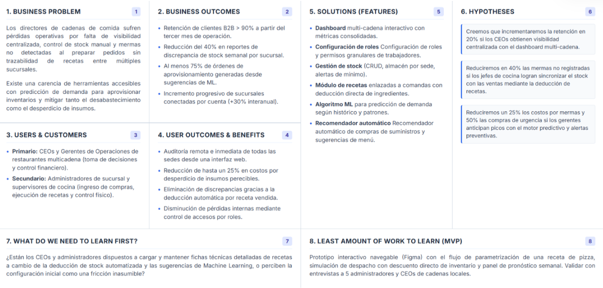
    </td>

## 1.3. Segmentos objetivo

# Capítulo II: Requirements Elicitation & Analysis

## 2.1. Competidores

### 2.1.1. Análisis competitivo

### 2.1.2. Estrategias y tácticas frente a competidores

## 2.2. Entrevistas

### 2.2.1. Diseño de entrevistas

### 2.2.2. Registro de entrevistas

### 2.2.3. Análisis de entrevistas

## 2.3. Needfinding

### 2.3.1. User Personas

### 2.3.2. User Task Matrix

### 2.3.3. User Journey Mapping

### 2.3.4. Empathy Mapping

## 2.4. Big Picture Event Storming

## 2.5. Ubiquitous Language

# Capítulo III: Requirements Specification

## 3.1. User Stories
<table>
<tr><th>Story ID</th><th>Título</th><th>Descripción</th><th>Criterios de Aceptación</th><th>Relacionado con Epic ID</th></tr>

<tr>
<td><strong>US01</strong></td>
<td>Conocer la propuesta de valor de StockIA</td>
<td>Como visitante del sitio, quiero ver de inmediato de qué trata StockIA y qué problema resuelve, para decidir en pocos segundos si es relevante para mi restaurante.</td>
<td>
<strong>Escenario 1: Visualización del mensaje principal</strong> 
Dado que un visitante ingresa a index.html 
Cuando la página carga 
Entonces el sistema muestra en el hero un título con la propuesta de valor, una descripción y el nombre de la startup. 

<strong>Escenario 2: Llamados a la acción visibles</strong> 
Dado que el visitante revisa el hero 
Cuando observa los botones disponibles 
Entonces el sistema presenta un botón principal y uno secundario que lleva a features.html. 

<strong>Escenario 3: Coherencia del CTA con el flujo de demo</strong> 
Dado que el visitante hace clic en "Optimiza tu inventario" 
Cuando el sistema procesa el clic 
Entonces lo dirige a la sección de solicitud de demo, no a un dashboard interactivo (aún no implementado).
</td>
<td>EP01 — Landing Page</td>
</tr>

<tr>
<td><strong>US02</strong></td>
<td>Ver una vista previa del dashboard de StockIA</td>
<td>Como visitante, quiero ver una representación visual del futuro dashboard, para entender cómo luciría el producto antes de solicitar una demo.</td>
<td>
<strong>Escenario 1: Mockup visible en escritorio</strong> 
Dado que un visitante accede desde escritorio 
Cuando la página del Home carga 
Entonces el sistema muestra un mockup ilustrativo del dashboard. 

<strong>Escenario 2: Mockup oculto en móvil</strong> 
Dado que el ancho de pantalla es menor a 768px 
Cuando la página carga 
Entonces el sistema oculta el mockup para priorizar el texto.
</td>
<td>EP01 — Landing Page</td>
</tr>

<tr>
<td><strong>US03</strong></td>
<td>Conocer estadísticas e indicadores de impacto de StockIA</td>
<td>Como visitante, quiero ver cifras sobre el desperdicio y el impacto económico de usar StockIA, para dimensionar el beneficio potencial en mi negocio.</td>
<td>
<strong>Escenario 1: Barra de estadísticas</strong> 
Dado que el visitante se desplaza por el Home 
Cuando llega a la barra de estadísticas 
Entonces el sistema presenta cuatro indicadores de impacto. 

<strong>Escenario 2: Transparencia sobre cifras de ejemplo</strong> 
Dado que las cifras son referenciales 
Cuando el visitante las revisa 
Entonces el sistema indica que son cifras de ejemplo pendientes de validar. 

<strong>Escenario 3: Indicadores de impacto económico y ambiental</strong> 
Dado que el visitante quiere entender el beneficio concreto 
Cuando revisa indicadores como "-25% desperdicio" 
Entonces interpreta en segundos el impacto esperado.
</td>
<td>EP01 — Landing Page</td>
</tr>

<tr>
<td><strong>US04</strong></td>
<td>Identificar si StockIA es para mi rol dentro del restaurante</td>
<td>Como dueño/CEO o administrador/jefe de cocina, quiero identificar contenido dirigido a mi rol, para reconocer que StockIA entiende mis necesidades particulares.</td>
<td>
<strong>Escenario 1: Segmento dueños y CEOs</strong> 
Dado que el visitante es dueño o CEO 
Cuando revisa "¿Para quién es StockIA?" 
Entonces ve una tarjeta orientada a inventario, mermas y rentabilidad. 

<strong>Escenario 2: Segmento administradores y jefes de cocina</strong> 
Dado que el visitante administra la operación diaria 
Cuando revisa la misma sección 
Entonces ve una tarjeta orientada a recetas, stock y alertas.
</td>
<td>EP01 — Landing Page</td>
</tr>

<tr>
<td><strong>US05</strong></td>
<td>Conocer las funcionalidades principales desde el Home</td>
<td>Como visitante, quiero ver un resumen de las funcionalidades clave sin salir del Home, para evaluar rápidamente el alcance del producto.</td>
<td>
<strong>Escenario 1: Visualización de las seis funcionalidades</strong> 
Dado que el visitante llega a la sección de funcionalidades 
Cuando la sección se renderiza 
Entonces el sistema muestra seis tarjetas de funcionalidades. 

<strong>Escenario 2: Acceso al detalle completo</strong> 
Dado que el visitante quiere más información 
Cuando hace clic en "Ver todas las características" 
Entonces el sistema lo redirige a features.html.
</td>
<td>EP01 — Landing Page</td>
</tr>

<tr>
<td><strong>US06</strong></td>
<td>Conocer los diferenciadores de StockIA</td>
<td>Como visitante, quiero entender qué hace distinto a StockIA de un simple control de inventario, para justificar por qué elegirlo.</td>
<td>
<strong>Escenario 1: Visualización de diferenciadores</strong> 
Dado que el visitante llega a "Más que un inventario" 
Cuando la sección se renderiza 
Entonces el sistema presenta tres tarjetas de diferenciadores.
</td>
<td>EP01 — Landing Page</td>
</tr>

<tr>
<td><strong>US07</strong></td>
<td>Conocer las integraciones externas en evaluación</td>
<td>Como visitante, quiero saber con qué otras herramientas podría integrarse StockIA, para entender qué tan conectado estará con servicios que ya uso.</td>
<td>
<strong>Escenario 1: Visualización de opciones de integración</strong> 
Dado que el visitante llega a "Integraciones" 
Cuando la sección se renderiza 
Entonces el sistema presenta cuatro tarjetas con la etiqueta "En evaluación". 

<strong>Escenario 2: Transparencia sobre la decisión pendiente</strong> 
Dado que ninguna integración fue elegida 
Cuando el visitante lee la introducción 
Entonces el sistema aclara que la decisión está pendiente.
</td>
<td>EP01 — Landing Page</td>
</tr>

<tr>
<td><strong>US08</strong></td>
<td>Explorar vistas ilustrativas de la plataforma</td>
<td>Como visitante, quiero ver ejemplos visuales de las pantallas de StockIA, para imaginar cómo sería usar el producto día a día.</td>
<td>
<strong>Escenario 1: Visualización del portafolio</strong> 
Dado que el visitante llega a "Portafolio" 
Cuando la sección se renderiza 
Entonces el sistema muestra cuatro vistas ilustrativas. 

<strong>Escenario 2: Cambio de pestaña visual</strong> 
Dado que el visitante hace clic en una pestaña 
Cuando la pestaña se selecciona 
Entonces el sistema resalta la pestaña activa.
</td>
<td>EP02 — Navegación</td>
</tr>

<tr>
<td><strong>US09</strong></td>
<td>Ver el video de presentación del producto</td>
<td>Como visitante, quiero ver un video que explique StockIA en acción, para comprender el producto más rápido que solo leyendo texto.</td>
<td>
<strong>Escenario 1: Video aún no disponible</strong> 
Dado que el video no ha sido grabado 
Cuando el visitante llega a la sección de video 
Entonces el sistema muestra un placeholder. 

<strong>Escenario 2: Reemplazo futuro del placeholder</strong> 
Dado que el equipo ya grabó el video 
Cuando se reemplaza el placeholder 
Entonces el visitante puede reproducirlo.
</td>
<td>EP01 — Landing Page</td>
</tr>

<tr>
<td><strong>US10</strong></td>
<td>Navegar entre las páginas del sitio</td>
<td>Como visitante, quiero moverme fácilmente entre Inicio, Características, Precios y Nosotros, para explorar el sitio según lo que me interese.</td>
<td>
<strong>Escenario 1: Navegación desde el menú superior</strong> 
Dado que el visitante está en cualquier página 
Cuando hace clic en un enlace del navbar 
Entonces el sistema lo lleva a la página correspondiente. 

<strong>Escenario 2: Identificación de la página actual</strong> 
Dado que el visitante está en una página específica 
Cuando el navbar se renderiza 
Entonces el sistema resalta el enlace activo.
</td>
<td>EP02 — Navegación</td>
</tr>

<tr>
<td><strong>US11</strong></td>
<td>Ver el detalle completo de las funcionalidades de StockIA</td>
<td>Como visitante interesado en profundizar, quiero ver una descripción extendida de cada funcionalidad, para evaluar si el producto cubre mis necesidades.</td>
<td>
<strong>Escenario 1: Grid completo de funcionalidades</strong> 
Dado que el visitante accede a features.html 
Cuando la página carga 
Entonces el sistema presenta las seis funcionalidades con descripción detallada.
</td>
<td>EP02 — Navegación</td>
</tr>

<tr>
<td><strong>US12</strong></td>
<td>Entender cómo empezar a usar StockIA</td>
<td>Como visitante interesado en adoptar StockIA, quiero conocer los pasos para comenzar a usarlo, para saber qué esperar antes de solicitar una demo.</td>
<td>
<strong>Escenario 1: Visualización de los pasos</strong> 
Dado que el visitante llega a "Cómo funciona" 
Cuando la sección se renderiza 
Entonces el sistema muestra cuatro pasos numerados.
</td>
<td>EP02 — Navegación</td>
</tr>

<tr>
<td><strong>US13</strong></td>
<td>Cambiar el idioma del sitio entre español e inglés</td>
<td>Como visitante que prefiere leer en inglés, quiero cambiar el idioma del sitio, para entender el contenido sin depender de traducción externa.</td>
<td>
<strong>Escenario 1: Cambio a inglés</strong> 
Dado que el visitante está en español 
Cuando hace clic en "EN" 
Entonces el sistema traduce todos los textos al inglés. 

<strong>Escenario 2: Regreso a español</strong> 
Dado que el sitio está en inglés 
Cuando hace clic en "ES" 
Entonces el sistema restaura los textos al español.
</td>
<td>EP03 — Internacionalización</td>
</tr>

<tr>
<td><strong>US14</strong></td>
<td>Mantener mi idioma preferido al navegar entre páginas</td>
<td>Como visitante que ya eligió un idioma, quiero que esa preferencia se mantenga al ir a otra página, para no reseleccionar el idioma en cada una.</td>
<td>
<strong>Escenario 1: Persistencia del idioma</strong> 
Dado que el visitante seleccionó inglés 
Cuando navega a otra página 
Entonces el sistema carga esa página ya traducida.
</td>
<td>EP03 — Internacionalización</td>
</tr>

<tr>
<td><strong>US15</strong></td>
<td>Consultar los planes disponibles y sus características</td>
<td>Como visitante interesado en el precio, quiero ver los planes de StockIA y qué incluye cada uno, para elegir la opción que mejor se ajuste a mi restaurante.</td>
<td>
<strong>Escenario 1: Visualización de los tres planes</strong> 
Dado que el visitante accede a pricing.html 
Cuando la página carga 
Entonces el sistema muestra los planes Esencial, Profesional e IoT Completo. 

<strong>Escenario 2: Transparencia sobre precios de ejemplo</strong> 
Dado que los precios son ilustrativos 
Cuando el visitante revisa la sección 
Entonces el sistema indica que son planes de ejemplo.
</td>
<td>EP04 — Planes y precios</td>
</tr>

<tr>
<td><strong>US16</strong></td>
<td>Comparar precios mensuales y anuales</td>
<td>Como visitante evaluando el costo, quiero alternar entre facturación mensual y anual, para comparar cuánto ahorraría pagando anualmente.</td>
<td>
<strong>Escenario 1: Cambio a facturación anual</strong> 
Dado que los planes muestran precio mensual 
Cuando el visitante activa "Anual" 
Entonces el sistema actualiza el monto con descuento anual. 

<strong>Escenario 2: Regreso a facturación mensual</strong> 
Dado que el interruptor está en "Anual" 
Cuando el visitante lo desactiva 
Entonces el sistema restaura los montos mensuales.
</td>
<td>EP04 — Planes y precios</td>
</tr>

<tr>
<td><strong>US17</strong></td>
<td>Resolver dudas frecuentes sobre los planes</td>
<td>Como visitante con dudas puntuales, quiero consultar preguntas frecuentes sobre los planes, para resolver objeciones antes de solicitar una demo.</td>
<td>
<strong>Escenario 1: Apertura de una pregunta</strong> 
Dado que el visitante llega al FAQ 
Cuando hace clic en una pregunta cerrada 
Entonces el sistema despliega la respuesta. 

<strong>Escenario 2: Solo una pregunta abierta a la vez</strong> 
Dado que una pregunta ya está desplegada 
Cuando el visitante abre otra 
Entonces el sistema cierra la anterior.
</td>
<td>EP04 — Planes y precios</td>
</tr>

<tr>
<td><strong>US18</strong></td>
<td>Conocer la misión, visión y valores de DataBite Corp</td>
<td>Como visitante, quiero conocer el propósito y los valores del equipo detrás de StockIA, para generar confianza antes de contactarlos.</td>
<td>
<strong>Escenario 1: Visualización de misión y visión</strong> 
Dado que el visitante accede a about.html 
Cuando la página carga 
Entonces el sistema muestra la misión, visión y valores destacados.
</td>
<td>EP01 — Landing Page</td>
</tr>

<tr>
<td><strong>US19</strong></td>
<td>Conocer al equipo detrás de StockIA</td>
<td>Como visitante, quiero ver quiénes conforman el equipo de DataBite Corp, para saber que hay personas reales respaldando el producto.</td>
<td>
<strong>Escenario 1: Visualización de fichas de equipo</strong> 
Dado que el visitante llega a "Equipo" 
Cuando la sección se renderiza 
Entonces el sistema muestra fichas con nombre, rol y código. 

<strong>Escenario 2: Transparencia sobre datos pendientes</strong> 
Dado que los datos no fueron completados 
Cuando el visitante revisa la sección 
Entonces el sistema muestra una nota de "fichas de ejemplo".
</td>
<td>EP05 — Sobre DataBite Corp</td>
</tr>

<tr>
<td><strong>US20</strong></td>
<td>Solicitar una demo mediante un formulario de contacto</td>
<td>Como visitante interesado en StockIA, quiero enviar mis datos y una breve descripción de mi restaurante, para que DataBite Corp se contacte conmigo.</td>
<td>
<strong>Escenario 1: Envío exitoso del formulario</strong> 
Dado que el visitante completa nombre y correo 
Cuando presiona "Enviar solicitud" 
Entonces el sistema muestra confirmación y limpia el formulario. 

<strong>Escenario 2: Campos obligatorios incompletos</strong> 
Dado que deja vacío el nombre o correo 
Cuando intenta enviar 
Entonces el navegador bloquea el envío. 

<strong>Escenario 3: Acceso al formulario desde cualquier página</strong> 
Dado que hace clic en cualquier botón "Solicitar demo" 
Cuando el clic se ejecuta 
Entonces el sistema lo dirige a la sección de contacto.
</td>
<td>EP05 — Sobre DataBite Corp</td>
</tr>

<tr>
<td><strong>US21</strong></td>
<td>Gestionar el inventario de insumos (alta, baja y modificación)</td>
<td>Como administrador, quiero agregar, eliminar y modificar insumos en el inventario, para mantener actualizado el stock de mi restaurante.</td>
<td>
<strong>Escenario 1: Registro de nuevo insumo</strong> 
Dado que el administrador está en el módulo de inventario 
Cuando agrega un nuevo insumo 
Entonces el sistema lo registra en la base de datos. 

<strong>Escenario 2: Eliminación de insumo</strong> 
Dado que un insumo ya no se usa 
Cuando lo elimina del inventario 
Entonces el sistema lo quita y ajusta reportes. 

<strong>Escenario 3: Actualización de cantidad tras pedido</strong> 
Dado que recibe un pedido de insumos 
Cuando modifica la cantidad 
Entonces el sistema actualiza el stock disponible. 

<strong>Escenario 4: Validación de datos obligatorios</strong> 
Dado que intenta registrar un insumo sin nombre o cantidad 
Cuando intenta guardar 
Entonces el sistema muestra un error.
</td>
<td>EP09 — Inventario y Recetas</td>
</tr>

<tr>
<td><strong>US22</strong></td>
<td>Vincular recetas al inventario con descuento automático de insumos</td>
<td>Como administrador, quiero guardar recetas con ingredientes vinculados al inventario, para que al venderse un plato se descuenten automáticamente los insumos.</td>
<td>
<strong>Escenario 1: Registro de receta con ingredientes</strong> 
Dado que registra la receta "Pizza Margarita" 
Cuando guarda la receta 
Entonces queda vinculada al inventario. 

<strong>Escenario 2: Descuento automático al vender un plato</strong> 
Dado que un cliente pide una Pizza Margarita 
Cuando se registra la venta 
Entonces el sistema descuenta los ingredientes. 

<strong>Escenario 3: Alerta por stock insuficiente</strong> 
Dado que un insumo no tiene stock suficiente 
Cuando se intenta registrar la venta 
Entonces el sistema alerta que no puede completar el descuento.
</td>
<td>EP09 — Inventario y Recetas</td>
</tr>

<tr>
<td><strong>US23</strong></td>
<td>Visualizar un dashboard operativo con alertas y métricas clave</td>
<td>Como administrador, quiero ver un dashboard con métricas de stock y alertas, para tomar decisiones rápidas sobre insumos críticos.</td>
<td>
<strong>Escenario 1: Insumos bajos y próximos a vencer</strong> 
Dado que accede al dashboard 
Cuando se muestran los insumos críticos 
Entonces puede priorizar compras. 

<strong>Escenario 2: Métricas de ahorro y predicciones</strong> 
Dado que está en el dashboard 
Cuando se muestran métricas y predicciones 
Entonces puede evaluar el rendimiento. 

<strong>Escenario 3: Vista simplificada para el rol Empleado</strong> 
Dado que un Empleado accede al sistema 
Cuando visualiza su panel 
Entonces ve una vista simplificada sin métricas financieras.
</td>
<td>EP09 — Inventario y Recetas</td>
</tr>

<tr>
<td><strong>US24</strong></td>
<td>Configurar roles  de los empleados</td>
<td>Como administrador, quiero asignar roles a empleados, para que cada uno tenga recomendaciones personalizadas y permisos adecuados dentro del sistema.</td>
<td>
<strong>Escenario 1: Asignación de rol "Empleado" con recomendaciones limitadas</strong> 
Given que el administrador está en la configuración de usuarios 
When asigna a una persona el rol "Empleado" 
Then el sistema le da los permisos limitados y muestra únicamente las recomendaciones relacionadas con las tareas básicas de cocina o servicio 

<strong>Escenario 2: Asignación de rol "Administrador" con recomendaciones completas</strong> 
Given que el administrador está en la configuración de usuarios 
When asigna a una persona el rol "Administrador" 
Then el sistema habilita todos los permisos y recomendaciones, incluyendo predicciones de demanda, alertas de insumos y configuración de inventario. 

<strong>Escenario 3: Asignación de rol especializado (ej. Cocinero)</strong> 
Given que el administrador asigna un rol específico como "Cocinero" 
When el sistema genera recomendaciones 
Then el usuario recibe sugerencias personalizadas sobre preparación de recetas y cantidades de insumos, sin ver información de pagos o gestión administrativa.
</td>
<td>EP11 — Notificaciones Multicanal</td>
</tr>

<tr>
<td><strong>US25</strong></td>
<td>Recibir predicción de demanda según históricos y clima</td>
<td>Como administrador, quiero que el sistema prediga la demanda según históricos de ventas y clima, para poder preparar insumos con anticipación.</td>
<td>
<strong>Escenario 1: Proyección según día de la semana</strong> 
Dado que es un día laboral 
Cuando el sistema analiza históricos 
Entonces predice la demanda de platos. 

<strong>Escenario 2: Proyección en feriados locales</strong> 
Dado que se acerca un feriado 
Cuando cruza datos de asistencia 
Entonces proyecta mayor afluencia. 

<strong>Escenario 3: Aprendizaje continuo del modelo</strong> 
Dado que se registran nuevas ventas 
Cuando ajusta sus predicciones 
Entonces reflejan el comportamiento del restaurante.
</td>
<td>EP10 — Predicción de Demanda con IA</td>
</tr>

<tr>
<td><strong>US26</strong></td>
<td>Recibir recomendaciones automáticas de ajuste de menú</td>
<td>Como administrador, quiero recibir sugerencias de menú según popularidad y estacionalidad, para ajustar la oferta de mi restaurante.</td>
<td>
<strong>Escenario 1: Sugerencia por temporada estacional</strong> 
Dado que inicia una nueva temporada 
Cuando analiza los platos más vendidos 
Entonces sugiere incluir el más popular. 

<strong>Escenario 2: Reemplazo por baja popularidad</strong> 
Dado que un plato pierde popularidad 
Cuando analiza ventas decrecientes 
Entonces sugiere reemplazarlo. 

<strong>Escenario 3: Reconocimiento por aplicar una recomendación</strong> 
Dado que aplica una recomendación 
Cuando la venta confirma la mejora 
Entonces otorga un logro de gamificación.
</td>
<td>EP10 — Predicción de Demanda con IA</td>
</tr>

<tr>
<td><strong>US27</strong></td>
<td>Recibir alertas de insumos por stock bajo o vencimiento próximo</td>
<td>Como administrador, quiero recibir alertas antes de que falten insumos, para poder comprar con tiempo y evitar quiebres de stock.</td>
<td>
<strong>Escenario 1: Alerta por nivel bajo de stock</strong> 
Dado que un producto está por agotarse 
Cuando el sistema detecta el nivel bajo 
Entonces genera una alerta. 

<strong>Escenario 2: Alerta por proximidad de vencimiento</strong> 
Dado que un producto está próximo a vencer 
Cuando detecta la fecha cercana 
Entonces genera una alerta. 

<strong>Escenario 3: Priorización de alertas</strong> 
Dado que hay múltiples alertas activas 
Cuando abre el dashboard 
Entonces las prioriza por urgencia.
</td>
<td>EP10 — Predicción de Demanda con IA</td>
</tr>

<tr>
<td><strong>US28</strong></td>
<td>Recibir alertas y recomendaciones por WhatsApp</td>
<td>Como empleado, quiero recibir sugerencias y alertas en mi WhatsApp, para poder actuar rápido sin necesidad de entrar al sistema.</td>
<td>
<strong>Escenario 1: Recepción de recomendaciones</strong> 
Dado que soy empleado 
Cuando el sistema genera una recomendación 
Entonces recibo la notificación en WhatsApp. 

<strong>Escenario 2: Recepción de alertas críticas</strong> 
Dado que ocurre una alerta crítica 
Cuando el sistema detecta la anomalía 
Entonces recibo un mensaje en WhatsApp. 

<strong>Escenario 3: Información fuera del sistema</strong> 
Dado que estoy fuera del dashboard 
Cuando ocurre un evento relevante 
Entonces recibo un mensaje que me mantiene informado.
</td>
<td>EP11 — Notificaciones Multicanal</td>
</tr>

<tr>
<td><strong>US29</strong></td>
<td>Registrarme como nuevo usuario en StockIA</td>
<td>Como nuevo usuario, quiero registrarme en StockIA con mis datos, para poder acceder al sistema y configurar mi restaurante.</td>
<td>
<strong>Escenario 1: Registro exitoso</strong> 
Dado que ingresa correo, contraseña y nombre del restaurante 
Cuando envía el formulario 
Entonces el sistema confirma la creación de la cuenta. 

<strong>Escenario 2: Acceso inicial al dashboard</strong> 
Dado que la cuenta fue creada 
Cuando inicia sesión por primera vez 
Entonces accede al dashboard inicial. 

<strong>Escenario 3: Error por correo duplicado</strong> 
Dado que el correo ya existe 
Cuando intenta registrarse de nuevo 
Entonces el sistema muestra un error.
</td>
<td>EP12 — Autenticación y Cuentas</td>
</tr>

<tr>
<td><strong>US30</strong></td>
<td>Iniciar sesión con mis credenciales</td>
<td>Como usuario registrado, quiero iniciar sesión con mis credenciales, para poder acceder a mi dashboard personalizado.</td>
<td>
<strong>Escenario 1: Inicio de sesión exitoso</strong> 
Dado que ingresa correo y contraseña correctos 
Cuando hace clic en "Iniciar sesión" 
Entonces el sistema valida y muestra el dashboard. 

<strong>Escenario 2: Error de inicio de sesión</strong> 
Dado que ingresa credenciales incorrectas 
Cuando intenta iniciar sesión 
Entonces el sistema muestra un error. 

<strong>Escenario 3: Recuperación de contraseña</strong> 
Dado que olvidó su contraseña 
Cuando hace clic en "Recuperar contraseña" 
Entonces el sistema envía un enlace de recuperación.
</td>
<td>EP12 — Autenticación y Cuentas</td>
</tr>

<tr>
<td><strong>US31</strong></td>
<td>Pagar o renovar mi suscripción con Stripe o PayPal</td>
<td>Como administrador, quiero pagar mi suscripción con Stripe o PayPal, para poder seguir usando StockIA sin interrupciones.</td>
<td>
<strong>Escenario 1: Elegir un plan</strong> 
Dado que está en la sección de suscripciones 
Cuando selecciona un plan y paga 
Entonces el sistema confirma la activación. 

<strong>Escenario 2: Renovar el plan</strong> 
Dado que la suscripción está próxima a vencer 
Cuando paga la renovación 
Entonces el sistema extiende la vigencia. 

<strong>Escenario 3: Error de transacción</strong> 
Dado que intenta pagar un plan 
Cuando ocurre un error en la transacción 
Entonces el sistema muestra un error y permite reintentar.
</td>
<td>EP13 — Suscripciones y Pagos</td>
</tr>

<tr>
<td><strong>US32</strong></td>
<td>Recibir historial de alertas críticas por correo electrónico</td>
<td>Como administrador, quiero recibir alertas críticas por correo vía SendGrid, para tener un historial documentado de los eventos importantes.</td>
<td>
<strong>Escenario 1: Registro de stock bajo</strong> 
Dado que un insumo llega a nivel crítico 
Cuando el sistema detecta la condición 
Entonces envía un correo con el detalle. 

<strong>Escenario 2: Registro de anomalía en equipos</strong> 
Dado que ocurre una alerta en la cocina 
Cuando el sistema la registra 
Entonces envía un correo al administrador. 

<strong>Escenario 3: Historial consolidado</strong> 
Dado que se generan múltiples alertas en un día 
Cuando el sistema las procesa 
Entonces envía un correo resumen.
</td>
<td>EP11 — Notificaciones Multicanal</td>
</tr>

<tr>
<td><strong>US33</strong></td>
<td>Recibir SMS urgentes ante emergencias operativas</td>
<td>Como administrador, quiero recibir SMS críticos vía Twilio, para poder reaccionar rápido ante emergencias en tiempo real.</td>
<td>
<strong>Escenario 1: Alerta de equipo crítico</strong> 
Dado que un equipo presenta una falla grave 
Cuando el sistema detecta la anomalía 
Entonces envía un SMS inmediato. 

<strong>Escenario 2: Alerta de insumo urgente</strong> 
Dado que un insumo esencial está por agotarse 
Cuando detecta el nivel crítico 
Entonces envía un SMS urgente. 

<strong>Escenario 3: Notificación de riesgo operativo</strong> 
Dado que ocurre una situación que afecta la operación 
Cuando el sistema lo detecta 
Entonces envía un SMS inmediato.
</td>
<td>EP11 — Notificaciones Multicanal</td>
</tr>

<tr>
<td><strong>US34</strong></td>
<td>Consultar la vida útil predeterminada de un insumo mediante una API externa</td>
<td>Como administrador, quiero que el sistema consulte una API externa de vida útil de alimentos, para asignar automáticamente un tiempo de conservación estándar a cada insumo.</td>
<td>
<strong>Escenario 1: Consulta exitosa a la API</strong> 
Dado que registra un insumo sin fecha de vencimiento 
Cuando el sistema consulta la API de vida útil 
Entonces asigna un valor predeterminado. 

<strong>Escenario 2: Producto no encontrado en la API</strong> 
Dado que registra un insumo no disponible en la API 
Cuando el sistema intenta la consulta 
Entonces solicita ingresar la vida útil manualmente.
</td>
<td>EP09 — Inventario y Recetas</td>
</tr>

<tr>
<td><strong>US35</strong></td>
<td>Editar la vida útil sugerida de un insumo</td>
<td>Como administrador, quiero poder modificar la vida útil sugerida por la API, para ajustarla a las condiciones reales de mi restaurante.</td>
<td>
<strong>Escenario 1: Ajuste manual del valor sugerido</strong> 
Dado que el sistema asignó una vida útil predeterminada 
Cuando el administrador edita el valor 
Entonces el sistema guarda la nueva configuración. 

<strong>Escenario 2: Registro de condiciones especiales</strong> 
Dado que el insumo se congela en lugar de refrigerarse 
Cuando cambia la condición de almacenamiento 
Entonces el sistema recalcula la vida útil.
</td>
<td>EP09 — Inventario y Recetas</td>
</tr>

<tr>
<td><strong>US36</strong></td>
<td>Calcular automáticamente la fecha límite de consumo de un insumo</td>
<td>Como administrador, quiero que el sistema calcule automáticamente la fecha límite de consumo según la vida útil registrada, para recibir alertas precisas de vencimiento.</td>
<td>
<strong>Escenario 1: Cálculo inicial de la fecha límite</strong> 
Dado que registra 50 kg de pollo con vida útil de 3 días 
Cuando guarda el insumo 
Entonces el sistema calcula y almacena la fecha límite.
</td>
<td>EP09 — Inventario y Recetas</td>
</tr>

<tr>
<td><strong>US37</strong></td>
<td>Recopilar automáticamente los datos de ventas diarias</td>
<td>Como administrador, quiero que el sistema recopile automáticamente los datos de ventas diarias, para que el modelo de Machine Learning pueda analizarlos y detectar patrones de consumo.</td>
<td>
<strong>Escenario 1: Registro automático de ventas</strong> 
Dado que se realiza una venta 
Cuando se confirma la transacción 
Entonces los datos se guardan para entrenamiento del modelo. 

<strong>Escenario 2: Consolidación de históricos</strong> 
Dado que existen múltiples ventas en un día 
Cuando el sistema procesa la información 
Entonces genera un registro consolidado.
</td>
<td>EP10 — Predicción de Demanda con IA</td>
</tr>

<tr>
<td><strong>US38</strong></td>
<td>Entrenar periódicamente el modelo de predicción de demanda</td>
<td>Como administrador, quiero que el sistema entrene periódicamente el modelo de Machine Learning con datos históricos, para que las predicciones sean cada vez más precisas.</td>
<td>
<strong>Escenario 1: Entrenamiento programado</strong> 
Dado que hay nuevos datos de ventas 
Cuando llega la fecha de entrenamiento programado 
Entonces el modelo se actualiza. 

<strong>Escenario 2: Mejora continua de la precisión</strong> 
Dado que el modelo se entrena con más datos 
Cuando se generan nuevas predicciones 
Entonces la precisión aumenta.
</td>
<td>EP10 — Predicción de Demanda con IA</td>
</tr>
<tr>
<td><strong>RNF01</strong></td>
<td>Experiencia responsiva en dispositivos móviles y tablets</td>
<td>Como visitante que navega desde el celular o una tablet, quiero que el sitio se adapte a mi pantalla, para poder leer y usar el sitio sin hacer zoom.</td>
<td>
<strong>Escenario 1: Colapso de columnas en pantallas medianas</strong> 
Cuando el visitante carga cualquier página 
Entonces el sistema reorganiza cuadrículas en menos columnas. 

<strong>Escenario 2: Diseño de una sola columna en móviles</strong> 
Cuando el visitante carga cualquier página 
Entonces el sistema apila en una sola columna.
</td>
<td>EP06 — Usabilidad</td>
</tr>

<tr>
<td><strong>RNF02</strong></td>
<td>Contraste y legibilidad accesible</td>
<td>Como visitante, incluyendo personas con baja visión, quiero que los textos tengan suficiente contraste con el fondo, para leer sin esfuerzo adicional.</td>
<td>
<strong>Escenario 1: Contraste en fondos claros</strong> 
Dado un texto sobre fondo claro 
Cuando el sistema aplica los estilos 
Entonces usa un color con contraste adecuado. 

<strong>Escenario 2: Contraste en fondos oscuros</strong> 
Dado un texto sobre fondo oscuro 
Cuando el sistema aplica los estilos 
Entonces el texto se muestra en blanco.
</td>
<td>EP06 — Usabilidad</td>
</tr>

<tr>
<td><strong>RNF03</strong></td>
<td>Navegación consistente y predecible entre páginas</td>
<td>Como visitante que recorre varias páginas, quiero encontrar siempre el mismo menú, pie de página y estilo visual, para no perder la orientación.</td>
<td>
<strong>Escenario 1: Mismo navbar y footer</strong> 
Dado que el visitante navega entre las cuatro páginas 
Cuando cada página carga 
Entonces el sistema muestra el mismo navbar y footer.
</td>
<td>EP06 — Usabilidad</td>
</tr>

<tr>
<td><strong>RNF04</strong></td>
<td>Carga rápida al ser un sitio estático sin dependencias pesadas</td>
<td>Como visitante con una conexión limitada, quiero que el sitio cargue rápido, para no abandonar la página mientras espera.</td>
<td>
<strong>Escenario 1: Sin frameworks pesados</strong> 
Dado que el sitio usa HTML/CSS/JS nativo 
Cuando cualquier página carga 
Entonces el sistema solo descarga sus propios archivos.
</td>
<td>EP07 — Rendimiento y compatibilidad</td>
</tr>

<tr>
<td><strong>RNF05</strong></td>
<td>Buen posicionamiento en buscadores</td>
<td>Como equipo de DataBite Corp, quiero que cada página tenga metadatos descriptivos, para mejorar la indexación de StockIA.</td>
<td>
<strong>Escenario 1: Metadatos presentes en cada página</strong> 
Dado que se inspecciona cualquier página 
Cuando se revisa su head 
Entonces el sistema incluye title y meta description.
</td>
<td>EP07 — Rendimiento y compatibilidad</td>
</tr>

<tr>
<td><strong>RNF06</strong></td>
<td>Compatibilidad con navegadores modernos de escritorio y móvil</td>
<td>Como visitante, quiero que el sitio se vea y funcione igual sin importar el navegador que use, para tener una experiencia confiable.</td>
<td>
<strong>Escenario 1: Uso de CSS estándar</strong> 
Dado que los estilos usan Flexbox y Grid 
Cuando el sitio se abre en un navegador moderno 
Entonces el sistema renderiza el layout correctamente.
</td>
<td>EP07 — Rendimiento y compatibilidad</td>
</tr>

<tr>
<td><strong>RNF07</strong></td>
<td>Animaciones de entrada que no bloquean la interacción</td>
<td>Como visitante, quiero que las animaciones de aparición sean sutiles y fluidas, para una experiencia moderna sin sentir la página lenta.</td>
<td>
<strong>Escenario 1: Aparición progresiva al hacer scroll</strong> 
Dado que el visitante se desplaza 
Cuando una tarjeta entra en el viewport 
Entonces el sistema aplica una transición de 0.5s.
</td>
<td>EP07 — Rendimiento y compatibilidad</td>
</tr>

<tr>
<td><strong>RNF08</strong></td>
<td>Identificación clara de contenido pendiente de completar</td>
<td>Como equipo de DataBite Corp, quiero que el contenido de ejemplo esté claramente señalizado, para no publicar por error información ficticia.</td>
<td>
<strong>Escenario 1: Señalización visible para el visitante</strong> 
Dado que existen datos de ejemplo 
Cuando el visitante revisa esas secciones 
Entonces el sistema muestra notas explícitas.
</td>
<td>EP02 — Navegación</td>
</tr>

<tr>
<td><strong>RNF09</strong></td>
<td>Sistema de diseño reutilizable y centralizado</td>
<td>Como equipo de desarrollo, quiero que colores, tipografías y espaciados estén centralizados en variables CSS, para actualizar la identidad visual desde un solo lugar.</td>
<td>
<strong>Escenario 1: Variables centralizadas en :root</strong> 
Dado que styles.css define variables en :root 
Cuando se necesita cambiar un color 
Entonces basta modificarlo una sola vez.
</td>
<td>EP02 — Navegación</td>
</tr>

<tr>
<td><strong>RNF10</strong></td>
<td>Textos traducibles centralizados en un solo archivo</td>
<td>Como equipo de desarrollo, quiero que todos los textos traducibles vivan en un único archivo, para actualizar el contenido sin editar cada página.</td>
<td>
<strong>Escenario 1: Único diccionario de traducciones</strong> 
Dado que i18n.js concentra los textos 
Cuando se necesita corregir un texto 
Entonces basta editar la llave correspondiente.
</td>
<td>EP03 — Internacionalización</td>
</tr>

<tr>
<td><strong>RNF11</strong></td>
<td>Protección de credenciales y datos de pago</td>
<td>Como usuario registrado, quiero que mis credenciales y datos de pago se manejen de forma segura, para confiar en la plataforma al usar mi tarjeta o PayPal.</td>
<td>
<strong>Escenario 1: Cifrado de contraseñas</strong> 
Dado que un usuario se registra o inicia sesión 
Cuando el sistema almacena su contraseña 
Entonces la guarda cifrada, nunca en texto plano. 

<strong>Escenario 2: Datos de pago gestionados por el proveedor externo</strong> 
Dado que un usuario realiza un pago 
Cuando ingresa los datos de su tarjeta 
Entonces son procesados directamente por Stripe o PayPal.
</td>
<td>EP14 — Seguridad y Confiabilidad</td>
</tr>

<tr>
<td><strong>RNF12</strong></td>
<td>Confiabilidad y trazabilidad de las notificaciones multicanal</td>
<td>Como administrador que depende de alertas por WhatsApp, correo y SMS, quiero que las notificaciones se envíen de forma confiable y quede registro de ellas.</td>
<td>
<strong>Escenario 1: Reintento ante falla de envío</strong> 
Dado que un envío falla por un problema de conexión 
Cuando el sistema detecta el error 
Entonces reintenta el envío o registra la falla. 

<strong>Escenario 2: Registro histórico de notificaciones</strong> 
Dado que el sistema envía cualquier alerta 
Cuando la notificación se entrega 
Entonces guarda un registro con fecha, canal y contenido.
</td>
<td>EP14 — Seguridad y Confiabilidad</td>
</tr>
</table>

## 3.2. Impact Mapping

## 3.3. Product Backlog
| # Orden | User Story ID | Título | Descripción | Story Points(1/2/3/5/8) |
| :---: | :--- | :--- | :--- | :---: |
| 1 | **US01** | Conocer la propuesta de valor de StockIA | Como visitante del sitio, quiero ver de inmediato de qué trata StockIA y qué problema resuelve, para decidir en pocos segundos si es relevante para mi restaurante. | 8 |
| 2 | **US20** | Solicitar una demo mediante un formulario de contacto | Como visitante interesado en StockIA, quiero enviar mis datos y una breve descripción de mi restaurante, para que DataBite Corp se contacte conmigo. | 8 |
| 3 | **US21** | Gestionar el inventario de insumos (alta, baja y modificación) | Como administrador, quiero agregar, eliminar y modificar insumos en el inventario, para mantener actualizado el stock de mi restaurante. | 8 |
| 4 | **US25** | Recibir predicción de demanda según históricos y clima | Como administrador, quiero que el sistema prediga la demanda según históricos de ventas y clima, para poder preparar insumos con anticipación. | 8 |
| 5 | **US37** | Recopilar automáticamente los datos de ventas diarias | Como administrador, quiero que el sistema recopile automáticamente los datos de ventas diarias, para que el modelo de Machine Learning pueda analizarlos y detectar patrones de consumo. | 8 |
| 6 | **US38** | Entrenar periódicamente el modelo de predicción de demanda | Como administrador, quiero que el sistema entrene periódicamente el modelo de Machine Learning con datos históricos, para que las predicciones de demanda sean cada vez más precisas. | 8 |
| 7 | **US31** | Pagar o renovar mi suscripción con Stripe o PayPal | Como administrador, quiero pagar mi suscripción con Stripe o PayPal, para poder seguir usando StockIA sin interrupciones. | 8 |
| 8 | **US03** | Conocer estadísticas e indicadores de impacto de StockIA | Como visitante, quiero ver cifras sobre el desperdicio y el impacto económico de usar StockIA, para dimensionar el beneficio potencial en mi negocio. | 5 |
| 9 | **US04** | Identificar si StockIA es para mi rol dentro del restaurante | Como dueño/CEO o administrador/jefe de cocina, quiero identificar contenido dirigido a mi rol, para reconocer que StockIA entiende mis necesidades particulares. | 5 |
| 10 | **US15** | Consultar los planes disponibles y sus características | Como visitante interesado en el precio, quiero ver los planes de StockIA y qué incluye cada uno, para elegir la opción que mejor se ajuste a mi restaurante. | 5 |
| 11 | **US22** | Vincular recetas al inventario con descuento automático de insumos | Como administrador, quiero guardar recetas con ingredientes vinculados al inventario, para que al venderse un plato se descuenten automáticamente los insumos. | 5 |
| 12 | **US23** | Visualizar un dashboard operativo con alertas y métricas clave | Como administrador, quiero ver un dashboard con métricas de stock y alertas, para tomar decisiones rápidas sobre insumos críticos. | 5 |
| 13 | **US26** | Recibir recomendaciones automáticas de ajuste de menú | Como administrador, quiero recibir sugerencias de menú según popularidad y estacionalidad, para ajustar la oferta de mi restaurante. | 5 |
| 14 | **US27** | Recibir alertas de insumos por stock bajo o vencimiento próximo | Como administrador, quiero recibir alertas antes de que falten insumos, para poder comprar con tiempo y evitar quiebres de stock. | 5 |
| 15 | **US28** | Recibir alertas y recomendaciones por WhatsApp | Como empleado, quiero recibir sugerencias y alertas en mi WhatsApp, para poder actuar rápido sin necesidad de entrar al sistema. | 5 |
| 16 | **US29** | Registrarme como nuevo usuario en StockIA | Como nuevo usuario, quiero registrarme en StockIA con mis datos, para poder acceder al sistema y configurar mi restaurante. | 5 |
| 17 | **US30** | Iniciar sesión con mis credenciales | Como usuario registrado, quiero iniciar sesión con mis credenciales, para poder acceder a mi dashboard personalizado. | 5 |
| 18 | **US34** | Consultar la vida útil predeterminada de un insumo mediante una API externa | Como administrador, quiero que el sistema consulte una API externa de vida útil de alimentos, para asignar automáticamente un tiempo de conservación estándar a cada insumo. | 5 |
| 19 | **US36** | Calcular automáticamente la fecha límite de consumo de un insumo | Como administrador, quiero que el sistema calcule automáticamente la fecha límite de consumo según la vida útil registrada, para recibir alertas precisas de vencimiento. | 5 |
| 20 | **RNF11** | Protección de credenciales y datos de pago | Como usuario registrado, quiero que mis credenciales y mis datos de pago se manejen de forma segura, para confiar en la plataforma al usar mi tarjeta o mi cuenta de PayPal. | 5 |
| 21 | **RNF12** | Confiabilidad y trazabilidad de las notificaciones multicanal | Como administrador que depende de alertas por WhatsApp, correo y SMS, quiero que las notificaciones se envíen de forma confiable y quede registro de ellas, para no perder información crítica de mi restaurante. | 5 |
| 22 | **US02** | Ver una vista previa del dashboard de StockIA | Como visitante, quiero ver una representación visual del futuro dashboard, para entender cómo luciría el producto antes de solicitar una demo. | 3 |
| 23 | **US05** | Conocer las funcionalidades principales desde el Home | Como visitante, quiero ver un resumen de las funcionalidades clave de StockIA sin salir del Home, para evaluar rápidamente el alcance del producto. | 3 |
| 24 | **US06** | Conocer los diferenciadores de StockIA | Como visitante, quiero entender qué hace distinto a StockIA de un simple control de inventario, para justificar por qué elegirlo. | 3 |
| 25 | **US07** | Conocer las integraciones externas en evaluación | Como visitante, quiero saber con qué otras herramientas podría integrarse StockIA, para entender qué tan conectado estará con servicios que ya uso. | 3 |
| 26 | **US09** | Ver el video de presentación del producto | Como visitante, quiero ver un video que explique StockIA en acción, para comprender el producto más rápido que solo leyendo texto. | 3 |
| 27 | **US13** | Cambiar el idioma del sitio entre español e inglés | Como visitante que prefiere leer en inglés, quiero cambiar el idioma del sitio, para entender el contenido sin depender de traducción externa. | 3 |
| 28 | **US16** | Comparar precios mensuales y anuales | Como visitante evaluando el costo, quiero alternar entre facturación mensual y anual, para comparar cuánto ahorraría pagando anualmente. | 3 |
| 29 | **US17** | Resolver dudas frecuentes sobre los planes | Como visitante con dudas puntuales, quiero consultar preguntas frecuentes sobre los planes, para resolver objeciones antes de solicitar una demo. | 3 |
| 30 | **US24** | Configurar roles y permisos de los empleados | Como administrador, quiero asignar roles a empleados, para que cada uno tenga permisos adecuados dentro del sistema. | 3 |
| 31 | **US32** | Recibir historial de alertas críticas por correo electrónico | Como administrador, quiero recibir alertas críticas por correo vía SendGrid, para tener un historial documentado de eventos importantes. | 3 |
| 32 | **US33** | Recibir SMS urgentes ante emergencias operativas | Como administrador, quiero recibir SMS críticos vía Twilio, para poder reaccionar rápido ante emergencias en tiempo real. | 3 |
| 33 | **US35** | Editar la vida útil sugerida de un insumo | Como administrador, quiero poder modificar la vida útil sugerida por la API, para ajustarla a las condiciones reales de mi restaurante. | 3 |
| 34 | **RNF01** | Experiencia responsiva en dispositivos móviles y tablets | Como visitante que navega desde el celular o una tablet, quiero que el sitio se adapte a mi pantalla, para poder leer y usar el sitio sin hacer zoom ni desplazamiento horizontal. | 3 |
| 35 | **RNF04** | Carga rápida al ser un sitio estático sin dependencias pesadas | Como visitante con una conexión limitada, quiero que el sitio cargue rápido, para no abandonar la página mientras espera que termine de cargar. | 3 |
| 36 | **RNF05** | Buen posicionamiento en buscadores | Como equipo de DataBite Corp, quiero que cada página tenga metadatos descriptivos, para mejorar la indexación de StockIA en motores de búsqueda. | 3 |
| 37 | **US08** | Explorar vistas ilustrativas de la plataforma | Como visitante, quiero ver ejemplos visuales de las pantallas de StockIA, para imaginar cómo sería usar el producto día a día. | 2 |
| 38 | **US10** | Navegar entre las páginas del sitio | Como visitante, quiero moverme fácilmente entre Inicio, Características, Precios y Nosotros, para explorar el sitio según lo que me interese. | 2 |
| 39 | **US11** | Ver el detalle completo de las funcionalidades de StockIA | Como visitante interesado en profundizar, quiero ver una descripción extendida de cada funcionalidad, para evaluar si el producto cubre mis necesidades. | 2 |
| 40 | **US12** | Entender cómo empezar a usar StockIA | Como visitante interesado en adoptar StockIA, quiero conocer los pasos para comenzar a usarlo, para saber qué esperar antes de solicitar una demo. | 2 |
| 41 | **US14** | Mantener mi idioma preferido al navegar entre páginas | Como visitante que ya eligió un idioma, quiero que esa preferencia se mantenga al ir a otra página, para no reseleccionar el idioma en cada una. | 2 |
| 42 | **US18** | Conocer la misión, visión y valores de DataBite Corp | Como visitante, quiero conocer el propósito y valores del equipo detrás de StockIA, para generar confianza antes de contactarlos. | 2 |
| 43 | **US19** | Conocer al equipo detrás de StockIA | Como visitante, quiero ver quiénes conforman el equipo de DataBite Corp, para saber que hay personas reales respaldando el producto. | 2 |
| 44 | **RNF02** | Contraste y legibilidad accesible | Como visitante, incluyendo personas con baja visión, quiero que los textos tengan suficiente contraste con el fondo, para poder leer el contenido sin esfuerzo adicional. | 2 |
| 45 | **RNF03** | Navegación consistente y predecible entre páginas | Como visitante que recorre varias páginas, quiero encontrar siempre el mismo menú, pie de página y estilo visual, para no perder la orientación. | 2 |
| 46 | **RNF06** | Compatibilidad con navegadores modernos de escritorio y móvil | Como visitante, quiero que el sitio se vea y funcione igual sin importar el navegador que use, para tener una experiencia confiable. | 2 |
| 47 | **RNF07** | Animaciones de entrada que no bloquean la interacción | Como visitante, quiero que las animaciones de aparición sean sutiles y fluidas, para una experiencia moderna sin sentir la página lenta. | 1 |
| 48 | **RNF08** | Identificación clara de contenido pendiente de completar | Como equipo de DataBite Corp, quiero que el contenido de ejemplo esté claramente señalizado, para no publicar por error información ficticia como definitiva. | 1 |
| 49 | **RNF09** | Sistema de diseño reutilizable y centralizado | Como equipo de desarrollo, quiero que colores, tipografías y espaciados estén centralizados en variables CSS, para actualizar la identidad visual desde un solo lugar. | 1 |
| 50 | **RNF10** | Textos traducibles centralizados en un solo archivo | Como equipo de desarrollo, quiero que todos los textos traducibles vivan en un único archivo, para actualizar el contenido sin editar cada página. | 1 |

 

  
   <i>Artefacto: Jira para Epics</i>

  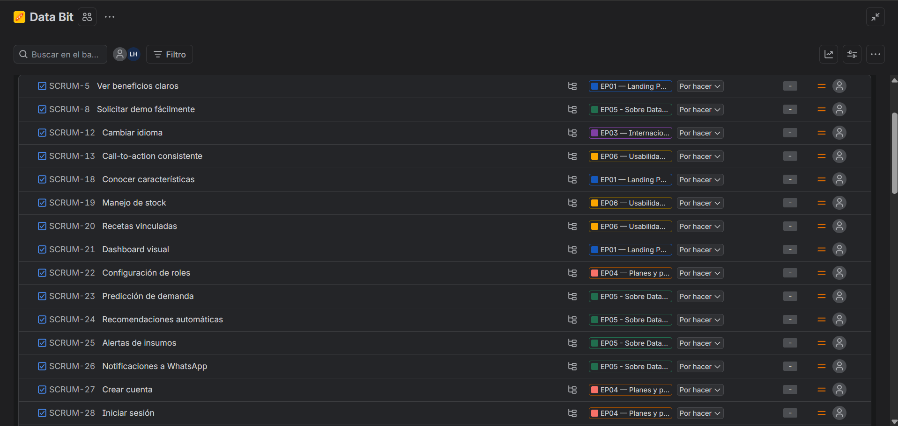
   <i>Artefacto: Jira para User Storys</i>

  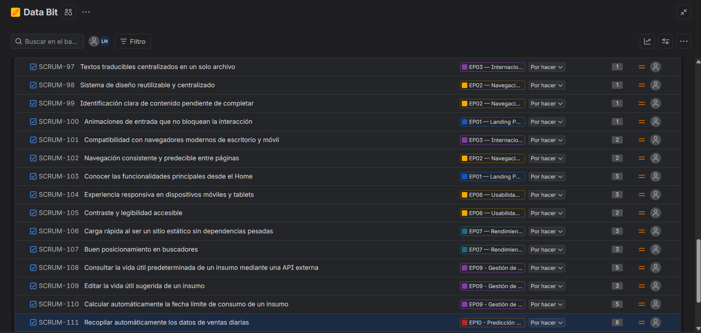
   <i>Artefacto: Jira para Backlog Priorizado</i>

>Acceso a artefacto Jira para el desarrollo de Backlog
<https://laplaceho-22.atlassian.net/jira/software/projects/SCRUM/boards/1?filter=&groupBy=none&atlOrigin=eyJpIjoiOGVhOTM0YjRkNzZkNGEzZWExMmY0ZmQ4MTU1NTcyYmQiLCJwIjoiaiJ9>

# Capítulo IV: Product Design

## 4.1. Style Guidelines

### 4.1.1. General Style Guidelines

### 4.1.2. Web Style Guidelines

## 4.2. Information Architecture

### 4.2.1. Organization Systems

### 4.2.2. Labeling Systems

### 4.2.3. SEO Tags and Meta Tags

### 4.2.4. Searching Systems

### 4.2.5. Navigation Systems

## 4.3. Landing Page UI Design

### 4.3.1. Landing Page Wireframe

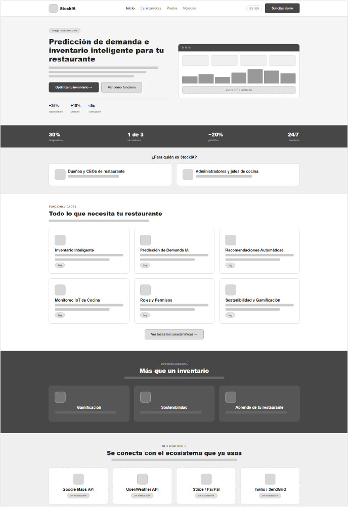

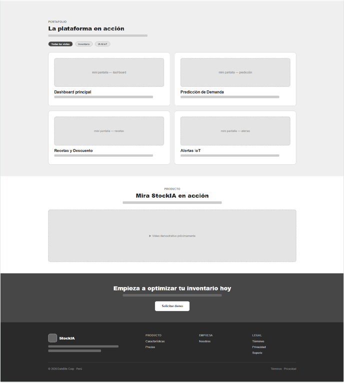
 <i>Artefacto: Figma</i>

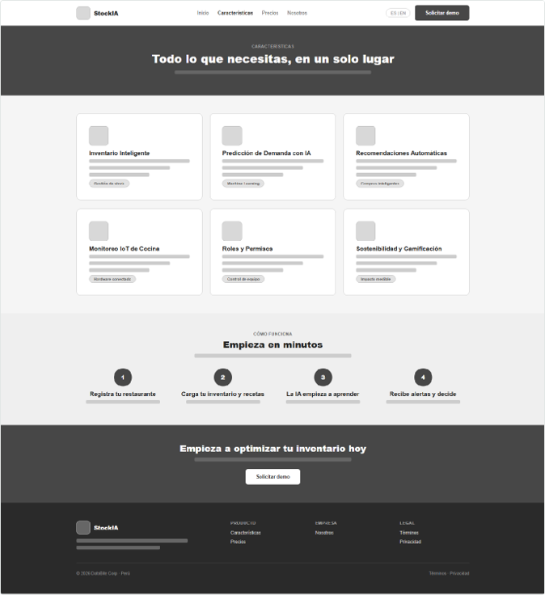
 <i>Artefacto: Figma</i>

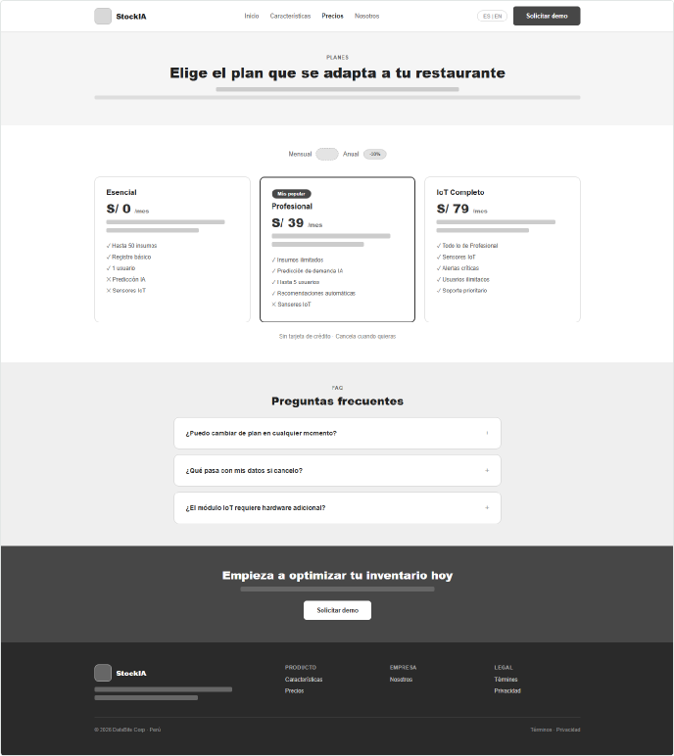
 <i>Artefacto: Figma</i>

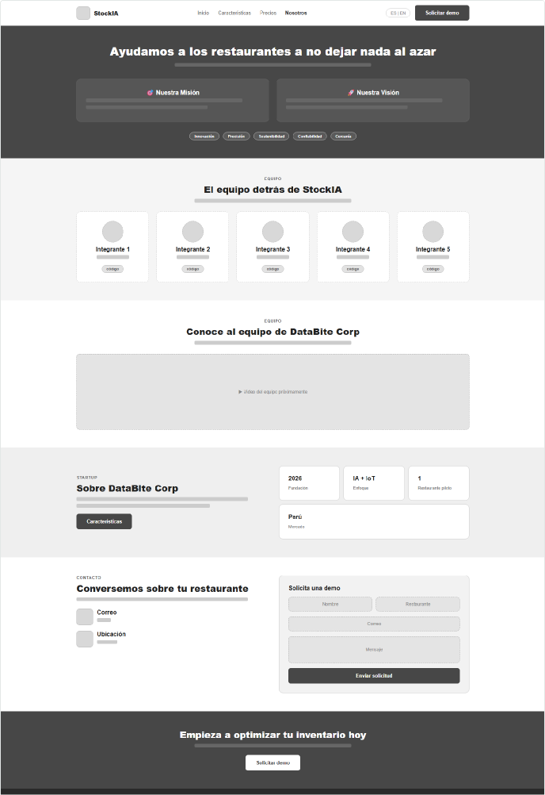
 <i>Artefacto: Figma</i>

### 4.3.2. Landing Page Mock-up

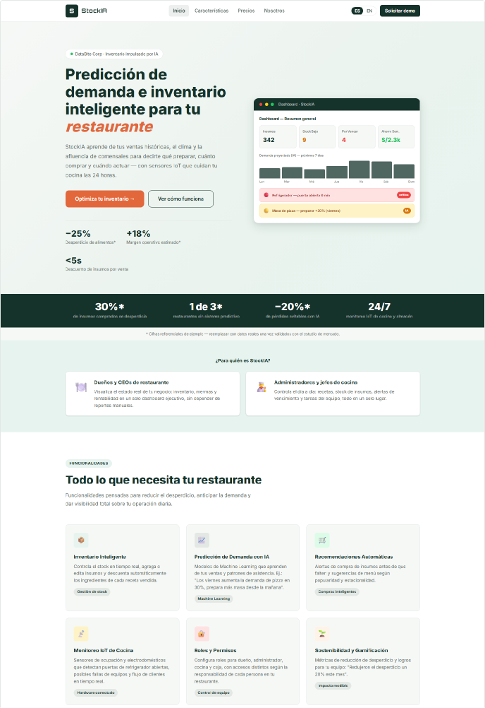

 <i>Artefacto: Figma</i>

 <i>Artefacto: Figma</i>

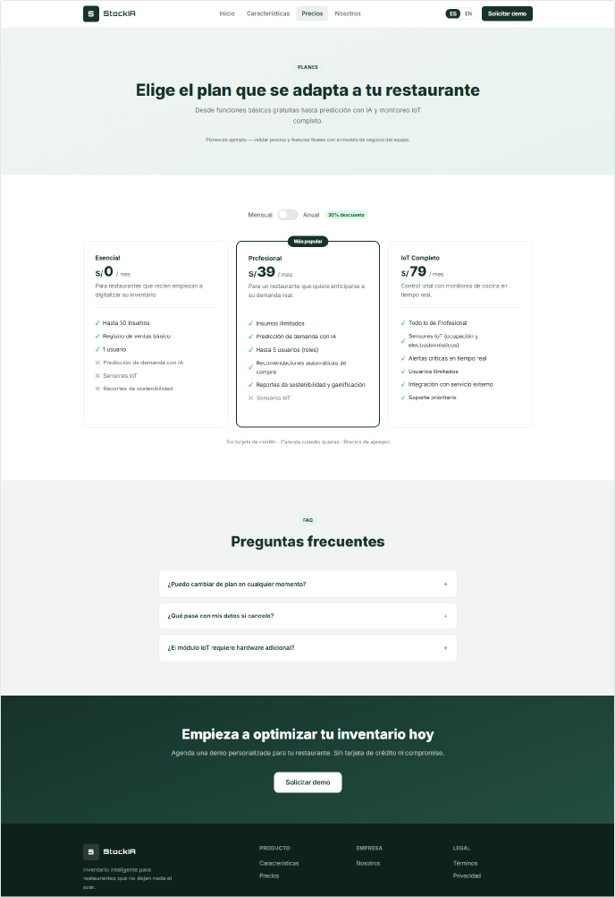
 <i>Artefacto: Figma</i>

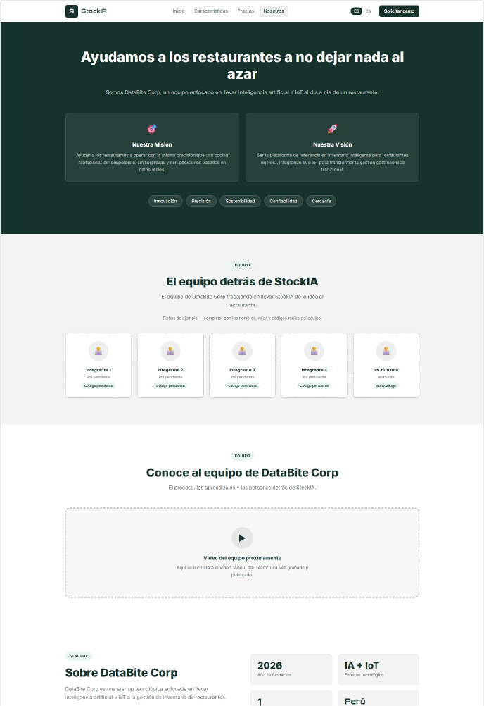
 <i>Artefacto: Figma</i>

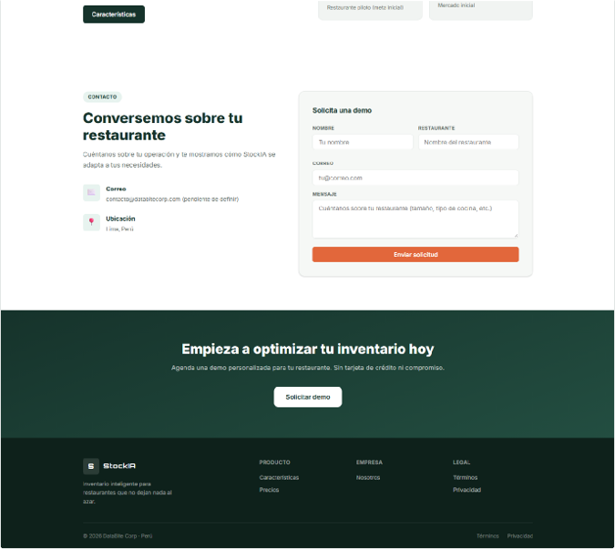
 <i>Artefacto: Figma</i>

## 4.4. Web Applications UX/UI Design

### 4.4.1. Web Applications Wireframes

### 4.4.2. Web Applications Wireflow Diagrams

### 4.4.3. Web Applications Mock-ups

### 4.4.4. Web Applications User Flow Diagrams

## 4.5. Web Applications Prototyping

## 4.6. Domain-Driven Software Architecture

### 4.6.1. Design-Level Event Storming

### 4.6.2. Software Architecture Context Diagram

### 4.6.3. Software Architecture Container Diagrams

### 4.6.4. Software Architecture Components Diagrams

## 4.7. Software Object-Oriented Design

### 4.7.1. Class Diagrams

## 4.8. Database Design

### 4.8.1. Database Diagrams

# Capítulo V: Product Implementation, Validation & Deployment

## 5.1. Software Configuration Management

### 5.1.1. Software Development Environment Configuration

### 5.1.2. Source Code Management

### 5.1.3. Source Code Style Guide & Conventions

### 5.1.4. Software Deployment Configuration

## 5.2. Landing Page, Services & Applications Implementation

### 5.2.1. Sprint 1
Este primer ciclo de desarrollo se centró en establecer los pilares de la identidad digital de **StockIA**, integrando el esfuerzo colaborativo del equipo para entregar un sitio de marketing funcional inicial. Durante este Sprint, el equipo priorizó la captación de visitantes mediante una Landing Page de 4 páginas (`index.html`, `features.html`, `pricing.html`, `about.html`), completamente bilingüe (ES/EN) y responsiva, documentando cada fase desde la planificación hasta el despliegue final para validar la propuesta de valor frente al segmento elegido.

#### 5.2.1.1. Sprint Planning 1
El Sprint Planning Meeting marcó el inicio formal del desarrollo del código de StockIA. Durante esta sesión, el equipo de desarrollo junto al Product Owner seleccionaron las Historias de Usuario más prioritarias del Product Backlog (correspondientes a los Epics EP01–EP08) para definir el objetivo central de la iteración. A continuación, se presenta el cuadro resumen con los detalles y acuerdos de esta reunión:

| **Sprint #** | Sprint 1 |
| :--- | :--- |
| **Sprint Planning Background** | |
| **Date** | 09/09/2026 |
| **Time** | 10:00 am |
| **Location** | Lima/Lima/Santiago de Surco/UPC |
| **Prepared By** | Huaman Oscco, Aldo Jesus (Jesusho22) |
| **Attendees (to planning meeting)** | Gallardo Morales, Carla Alejandra/ Huaman Oscco, Aldo Jesus/ Miranda Cordova, Jesus Angel Yvan/ Ortiz Laura, Leyla Alisson/ Toro Turpo, Ronal |
| **Sprint Review Summary** | Al ser el primer Sprint, la revisión anterior corresponde a la fase de ideación: segmentos objetivo y propuesta de valor. Resultados alcanzados: Arquitectura C4 finalizada, modelado de base de datos diseñada y repositorios GitHub configurados para el uso de gitflow. El Product Owner brindó el feedback necesario para iniciar la codificación orientada al dominio y siguiendo como base las User Storys. |
| **Sprint Retrospective Summary** | Como retrospectiva inicial de la forma de trabajo, el equipo identificó como acierto el uso de programas de trabajo remoto, el uso de herramientas colaborativos como GitHub y Jira, pero reconoció como oportunidad de mejora establecer reglas más estrictas de GitFlow para evitar colisiones en los Pull Requests futuros. |
| **Sprint Goal & User Stories** | |
| **Sprint 1 Goal** | **Contexto:** El equipo prioriza establecer la identidad digital de StockIA y comunicar la propuesta de valor a el segmento objetivo, publicando un sitio de marketing de 4 páginas totalmente bilingüe (ES/EN), antes de invertir esfuerzo en la Web Application.    **Sprint Goal:** *"Our focus is on building a trustworthy digital presence that clearly communicates StockIA's value proposition. We believe this will let visitors understand the product's benefits within seconds and request a demo with confidence. This will be confirmed when the four-page site is live, fully bilingual, responsive, and generating demo requests."* |
| **Sprint 1 Velocity** | 40 Story Points |
| **Sum of Story Points** | 88 Story Points |

#### 5.2.1.2. Aspect Leaders and Collaborators
* En esta sección se presenta la **Leadership-and-Collaboration Matrix (LACX)**. Esta matriz detalla los líderes (L) y colaboradores (C) para cada aspecto clave del Sprint, asegurando una comunicación clara y una distribución de responsabilidades eficiente para el proyecto **StockIA**.

La organización de líderes y colaboradores está directamente relacionada con la selección de tareas (tasks) que se desarrollarán durante el Sprint. Dado que este Sprint se concentra únicamente en la Landing Page, se proponen los siguientes aspectos:

| Team Member | GitHub Username | Maquetación & UI/UX (L/C) | Contenido & Traducción (i18n) (L/C) | Responsive & Accesibilidad (L/C) | Despliegue & QA (L/C) |
| :--- | :--- | :---: | :---: | :---: | :---: |
| Gallardo Morales, Carla Alejandra | Carlsss28 | L | C | C | C |
| Huaman Oscco, Aldo Jesus | Jesusho22 | C | C | C | L |
| Miranda Cordova, Jesus Angel Yvan | Jesus-Miranda-678 | C | C | L | C |
| Ortiz Laura, Leyla Alisson | Leylaa-O | L | C | C | C |
| Toro Turpo, Ronal | Ronal345 | C | L | C | C |
---

> **Leyenda:**   
> **L:** Líder (Líder del aspecto)  
> **C:** Colaborador (Colaborador y desarrollo)

#### 5.2.1.3. Sprint Backlog 1
**Periodo:** Semana 1 – Semana 2  
**Objetivo del Sprint:** Tener la Landing Page de StockIA (4 páginas) completamente maquetada, traducida ES/EN, responsiva y con el formulario de demo funcional, lista para publicarse.

---

| **User Story Id** | **Título de la Historia** | **Task Id** | **Título de la Tarea** | **Descripción de la Tarea** | **Est. (Hrs)** | **Asignado** | **Status** |
| :--- | :--- | :--- | :--- | :--- | :---: | :--- | :---: |
| **US01** | Conocer la propuesta de valor | T-01-1 | Maquetado del Hero | Construir el layout del hero con título, descripción y botones CTA. | 5 | Gallardo Morales, Carla Alejandra | Done |
|  |  | T-01-2 | Redacción y traducción del mensaje principal | Escribir el copy de la propuesta de valor en español e inglés. | 3 | Huaman Oscco, Aldo Jesus | Done |
| **US02** | Ver una vista previa del dashboard | T-02-1 | Mockup ilustrativo del dashboard | Maquetar las tarjetas y el gráfico ilustrativos con CSS. | 6 | Miranda Cordova, Jesus Angel Yvan | Done |
|  |  | T-02-2 | Responsive del mockup | Ocultar el mockup en pantallas menores a 768px. | 2 | Ortiz Laura, Leyla Alisson | Done |
| **US03** | Conocer estadísticas e indicadores | T-03-1 | Barra de estadísticas | Maquetar los cuatro indicadores de impacto del Home. | 4 | Toro Turpo, Ronal | Done |
|  |  | T-03-2 | Nota de transparencia | Redactar y traducir la nota de cifras de ejemplo. | 2 | Gallardo Morales, Carla Alejandra | Done |
| **US04** | Identificar si StockIA es para mi rol | T-04-1 | Sección "¿Para quién es StockIA?" | Maquetar las tarjetas por segmento (dueños/CEOs y administradores). | 4 | Huaman Oscco, Aldo Jesus | Done |
|  |  | T-04-2 | Redacción por segmento | Escribir el contenido diferenciado para cada rol. | 3 | Miranda Cordova, Jesus Angel Yvan | Done |
| **US05** | Conocer las funcionalidades principales | T-05-1 | Grid de seis funcionalidades | Maquetar las tarjetas de funcionalidades en el Home. | 5 | Ortiz Laura, Leyla Alisson | Done |
|  |  | T-05-2 | Enlace a features.html | Implementar el botón "Ver todas las características". | 2 | Toro Turpo, Ronal | Done |
| **US06** | Conocer los diferenciadores | T-06-1 | Sección "Más que un inventario" | Maquetar las tres tarjetas de diferenciadores. | 3 | Gallardo Morales, Carla Alejandra | Done |
|  |  | T-06-2 | Redacción y traducción | Escribir el contenido de cada diferenciador. | 2 | Huaman Oscco, Aldo Jesus | Done |
| **US07** | Conocer las integraciones externas | T-07-1 | Sección de integraciones | Maquetar las cuatro tarjetas con la etiqueta "En evaluación". | 3 | Miranda Cordova, Jesus Angel Yvan | Done |
|  |  | T-07-2 | Nota de transparencia | Redactar el texto que aclara que la decisión está pendiente. | 2 | Ortiz Laura, Leyla Alisson | Done |
| **US08** | Explorar vistas ilustrativas | T-08-1 | Sección de portafolio | Maquetar las cuatro vistas ilustrativas. | 5 | Toro Turpo, Ronal | Done |
|  |  | T-08-2 | Tabs de portafolio (JS) | Implementar el cambio de pestaña Inventario / IA & IoT. | 3 | Gallardo Morales, Carla Alejandra | Done |
| **US09** | Ver el video de presentación | T-09-1 | Placeholder de video | Maquetar el bloque "Video demostrativo próximamente". | 2 | Huaman Oscco, Aldo Jesus | Done |
|  |  | T-09-2 | Estructura para reemplazo futuro | Dejar preparado el iframe de YouTube comentado en el código. | 2 | Miranda Cordova, Jesus Angel Yvan | Done |
| **US10** | Navegar entre las páginas del sitio | T-10-1 | Navbar compartido | Implementar el menú superior en las 4 páginas. | 4 | Ortiz Laura, Leyla Alisson | Done |
|  |  | T-10-2 | Estado activo del enlace | Resaltar visualmente la página actual en el navbar. | 2 | Toro Turpo, Ronal | Done |
| **US11** | Ver el detalle completo de funcionalidades | T-11-1 | Grid completo en features.html | Maquetar las seis funcionalidades con descripción extendida. | 5 | Gallardo Morales, Carla Alejandra | Done |
| **US12** | Entender cómo empezar a usar StockIA | T-12-1 | Sección "Cómo funciona" | Maquetar los cuatro pasos numerados. | 4 | Huaman Oscco, Aldo Jesus | Done |
| **US13** | Cambiar el idioma del sitio | T-13-1 | Selector de idioma (ES/EN) | Implementar los botones de idioma en el navbar. | 3 | Miranda Cordova, Jesus Angel Yvan | Done |
|  |  | T-13-2 | Motor de traducción (i18n.js) | Programar el reemplazo de textos mediante data-i18n. | 6 | Ortiz Laura, Leyla Alisson | Done |
| **US14** | Mantener mi idioma preferido | T-14-1 | Persistencia en localStorage | Guardar y leer el idioma seleccionado entre páginas. | 3 | Toro Turpo, Ronal | Done |
| **US15** | Consultar los planes disponibles | T-15-1 | Maquetado de los 3 planes | Construir las tarjetas de Esencial, Profesional e IoT Completo. | 5 | Gallardo Morales, Carla Alejandra | Done |
|  |  | T-15-2 | Nota de precios de ejemplo | Redactar la nota de transparencia sobre precios ilustrativos. | 2 | Huaman Oscco, Aldo Jesus | Done |
| **US16** | Comparar precios mensuales y anuales | T-16-1 | Toggle mensual/anual (JS) | Implementar el interruptor y el recálculo de montos. | 4 | Miranda Cordova, Jesus Angel Yvan | Done |
| **US17** | Resolver dudas frecuentes | T-17-1 | Acordeón de preguntas frecuentes | Implementar la apertura/cierre exclusivo de preguntas. | 4 | Ortiz Laura, Leyla Alisson | Done |
|  |  | T-17-2 | Redacción de preguntas y respuestas | Escribir el contenido del FAQ en español e inglés. | 3 | Toro Turpo, Ronal | Done |
| **US18** | Conocer misión, visión y valores | T-18-1 | Sección misión/visión/valores | Maquetar el bloque correspondiente en about.html. | 3 | Gallardo Morales, Carla Alejandra | Done |
|  |  | T-18-2 | Redacción de contenido | Escribir la misión, visión y los cinco valores. | 2 | Huaman Oscco, Aldo Jesus | Done |
| **US19** | Conocer al equipo detrás de StockIA | T-19-1 | Fichas de equipo | Maquetar las cuatro fichas placeholder con nombre, rol y código. | 3 | Miranda Cordova, Jesus Angel Yvan | Done |
|  |  | T-19-2 | Nota de datos pendientes | Redactar la nota de "fichas de ejemplo". | 1 | Ortiz Laura, Leyla Alisson | Done |
| **US20** | Solicitar una demo mediante formulario | T-20-1 | Formulario de contacto | Maquetar el formulario con validación nativa de campos obligatorios. | 4 | Toro Turpo, Ronal | Done |
|  |  | T-20-2 | Confirmación visual de envío | Implementar el mensaje "✓ Enviado" y el reseteo del formulario. | 3 | Gallardo Morales, Carla Alejandra | Done |
|  |  | T-20-3 | Accesos al formulario | Enlazar los botones "Solicitar demo" del navbar, banner y footer. | 2 | Huaman Oscco, Aldo Jesus | Done |
| **RNF01** | Experiencia responsiva | T-R1-1 | Breakpoints de 1024px y 768px | Definir media queries para tablets y móviles. | 4 | Miranda Cordova, Jesus Angel Yvan | Done |
|  |  | T-R1-2 | Ajuste de cuadrículas | Reorganizar columnas y ocultar elementos no esenciales en móvil. | 4 | Ortiz Laura, Leyla Alisson | Done |
| **RNF02** | Contraste y legibilidad accesible | T-R2-1 | Paleta de contraste | Definir colores de texto con contraste adecuado sobre fondos claros y oscuros. | 3 | Toro Turpo, Ronal | Done |
| **RNF03** | Navegación consistente | T-R3-1 | Navbar y footer compartidos | Reutilizar los mismos componentes en las 4 páginas. | 3 | Gallardo Morales, Carla Alejandra | Done |
| **RNF04** | Carga rápida | T-R4-1 | Optimización de assets | Evitar frameworks y librerías pesadas innecesarias. | 3 | Huaman Oscco, Aldo Jesus | Done |
| **RNF05** | Buen posicionamiento en buscadores | T-R5-1 | Metadatos por página | Agregar title y meta description a cada página. | 2 | Miranda Cordova, Jesus Angel Yvan | Done |
|  |  | T-R5-2 | Metadatos adicionales del Home | Agregar meta keywords, author y copyright en index.html. | 2 | Ortiz Laura, Leyla Alisson | Done |
| **RNF06** | Compatibilidad con navegadores | T-R6-1 | CSS estándar (Flexbox/Grid) | Verificar compatibilidad en navegadores modernos. | 3 | Toro Turpo, Ronal | Done |
|  |  | T-R6-2 | Degradación de animaciones | Manejar el caso sin soporte de IntersectionObserver. | 2 | Gallardo Morales, Carla Alejandra | Done |
| **RNF07** | Animaciones de entrada | T-R7-1 | Scroll reveal (JS) | Implementar la animación de aparición progresiva de tarjetas. | 4 | Huaman Oscco, Aldo Jesus | Done |
| **RNF08** | Contenido pendiente señalizado | T-R8-1 | Notas visibles de contenido de ejemplo | Agregar notas junto a las secciones con datos ilustrativos. | 2 | Miranda Cordova, Jesus Angel Yvan | Done |
|  |  | T-R8-2 | Comentarios en el código | Documentar en HTML qué elementos deben reemplazarse. | 1 | Ortiz Laura, Leyla Alisson | Done |
| **RNF09** | Sistema de diseño centralizado | T-R9-1 | Variables CSS en :root | Centralizar colores, tipografías y espaciados. | 4 | Toro Turpo, Ronal | Done |
| **RNF10** | Textos centralizados (i18n) | T-R10-1 | Diccionario único de traducciones | Concentrar todos los textos ES/EN en i18n.js. | 4 | Gallardo Morales, Carla Alejandra | Done |
| **TOTAL** | | | | **Esfuerzo total estimado para el Sprint** | **162** | | |

---

  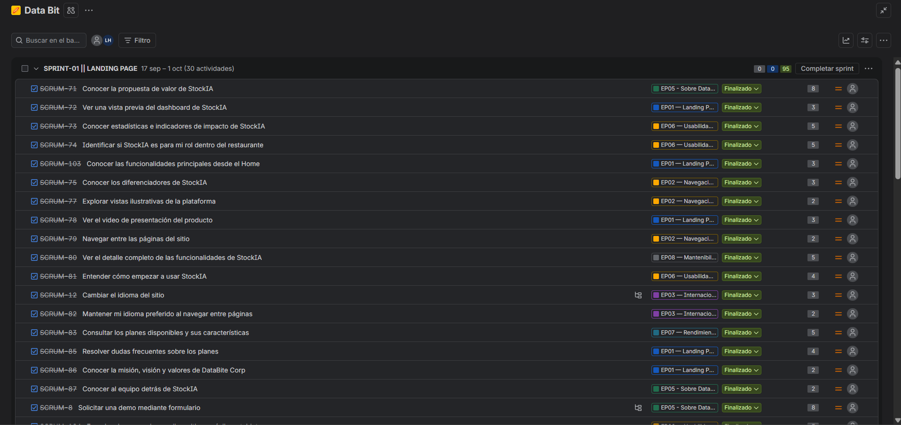
   <i>Artefacto: Jira para Sprint 1 Priorizado</i>

  
   <i>Artefacto: Jira para demostrar el tablero Kanban - Proceso -</i>

  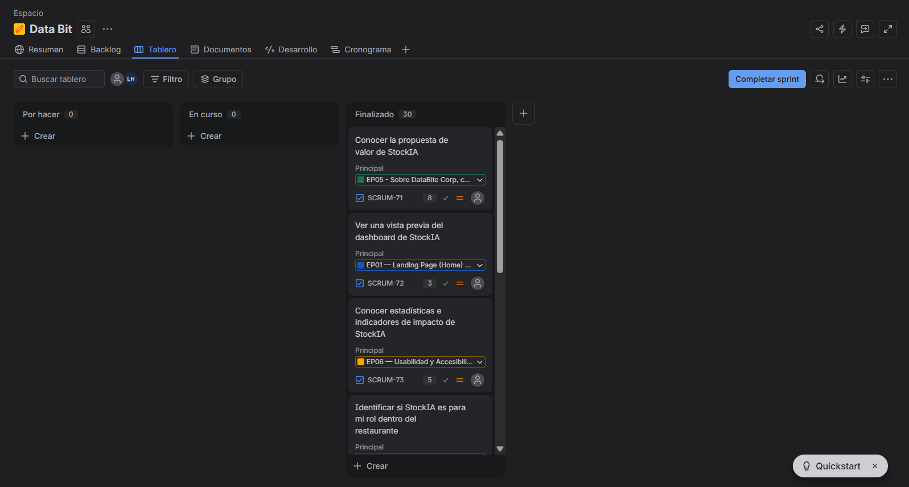
   <i>Artefacto: Jira para demostrar el tablero Kanban - Finalizado —</i>

##### Resumen Técnico
- **Total de Horas:** 162 horas.
- **Distribución:** 2 semanas de desarrollo (considerando jornada laboral estándar).
- **Entregable Principal:** Landing Page de StockIA (4 páginas), bilingüe ES/EN, responsiva, con formulario de solicitud de demo funcional.

---

#### 5.2.1.4. Development Evidence for Sprint Review
En esta sección se explica y presenta los avances en implementación con relación a los productos de la solución según el alcance del Sprint: Landing Page.

Primero, se mostrarán los commits más importantes para el Reporte, los cuales muestran el ciclo de vida del proyecto, y toda la información que se usó, usa y usará para el desarrollo del proyecto:

| **Repository** | **Branch** | **Commit Id** | **Commit Message** | **Commit Message Body** | **Committed on (Date)** |
| :--- | :--- | :--- | :--- | :--- | :---: |
| stockia-report | develop | _(completar)_ | _(completar)_ | _(completar — commits del repositorio de Reporte)_ | _(completar)_ |
| stockia-report | develop | _(completar)_ | _(completar)_ | _(completar)_ | _(completar)_ |
| stockia-report | develop | _(completar)_ | _(completar)_ | _(completar)_ | _(completar)_ |
| stockia-report | develop | _(completar)_ | _(completar)_ | _(completar)_ | _(completar)_ |
| stockia-report | develop | _(completar)_ | _(completar)_ | _(completar)_ | _(completar)_ |

 

A continuación se presentan los commits más importantes para la Landing Page, los cuales muestran todo el contenido visual y las funcionalidades implementadas en el Sprint 1:

| **Repository** | **Branch** | **Commit Id** | **Commit Message** | **Commit Message Body** | **Committed on (Date)** |
| :--- | :--- | :--- | :--- | :--- | :---: |
| stockia-website | develop | _(completar)_ | _(completar)_ | _(completar — commits del repositorio de la Landing Page ) | _(completar)_ |
| stockia-website | develop | _(completar)_ | _(completar)_ | _(completar — commits del repositorio de la Landing Page ) | _(completar)_ |
| stockia-website | develop | _(completar)_ | _(completar)_ | _(completar — commits del repositorio de la Landing Page ) | _(completar)_ |
| stockia-website | develop | _(completar)_ | _(completar)_ | _(completar)_ | _(completar)_ |
| stockia-website | develop | _(completar)_ | _(completar)_ | _(completar)_ | _(completar)_ |
 

#### 5.2.1.5. Execution Evidence for Sprint Review
En el Sprint 1 se busca implementar todas las secciones de las 4 páginas de la Landing Page de StockIA. A continuación, se explorarán los avances a través de imágenes que muestren el resultado obtenido (capturas pendientes de reemplazo):
 

1. **Sección header / navbar:** Barra de navegación compartida entre las 4 páginas del sitio, con selector de idioma (ES/EN).

 

  
   <i>Sección header / navbar — StockIA</i>

 

2. **Sección hero + mockup de dashboard:** Título con la propuesta de valor, descripción, botones CTA y un mockup ilustrativo del dashboard de StockIA.

 

  
   <i>Sección hero + mockup de dashboard — StockIA</i>

 

3. **Barra de estadísticas:** Los cuatro indicadores de impacto mostrados en el Home, con nota de transparencia sobre cifras de ejemplo.

 

  
   <i>Barra de estadísticas — StockIA</i>

 

4. **Sección "¿Para quién es StockIA?":** Tarjetas diferenciadas para los segmentos dueños/CEOs de restaurantes y administradores/jefes de cocina.

 

  
   <i>Sección "¿Para quién es StockIA?" — StockIA</i>

 

5. **Grid de funcionalidades:** Seis tarjetas de funcionalidades principales en el Home, con enlace al detalle completo en features.html.

 

  
   <i>Grid de funcionalidades — StockIA</i>

 

6. **Sección "Más que un inventario" (diferenciadores):** Las tres tarjetas de diferenciadores de StockIA frente a otras soluciones.

 

  
   <i>Sección "Más que un inventario" (diferenciadores) — StockIA</i>

 

7. **Sección de integraciones externas:** Las cuatro tarjetas de integraciones en evaluación (Google Maps, OpenWeather, Stripe/PayPal, Twilio/SendGrid), con nota de decisión pendiente.

 

  
   <i>Sección de integraciones externas — StockIA</i>

 

8. **Sección de portafolio:** Vistas ilustrativas con tabs para alternar entre Inventario e IA & IoT.

 

  
   <i>Sección de portafolio — StockIA</i>

 

9. **Placeholder de video demostrativo:** Bloque "Video demostrativo próximamente", con el iframe de YouTube ya preparado en el código para su reemplazo futuro.

 

  
   <i>Placeholder de video demostrativo — StockIA</i>

 

10. **features.html — grid completo:** Detalle extendido de las seis funcionalidades y la sección "Cómo funciona" (4 pasos).

 

  
   <i>features.html — grid completo — StockIA</i>

 

11. **pricing.html — planes y FAQ:** Las tarjetas de los planes Esencial, Profesional e IoT Completo, el toggle mensual/anual y el acordeón de preguntas frecuentes.

 

  
   <i>pricing.html — planes y FAQ — StockIA</i>

 

12. **about.html — misión, visión, equipo y formulario:** Sección de misión/visión/valores, las fichas de equipo (placeholder) y el formulario de solicitud de demo.

 

  
   <i>about.html — misión, visión, equipo y formulario — StockIA</i>

 

13. **Sección footer:** Parte final del sitio, compartida entre las 4 páginas.

 

  
   <i>Sección footer — StockIA</i>

 

Para finalizar, se mostrará una demostración del avance sobre la Landing Page dentro de GitHub, para la publicación de la página web:

  
   <i>Repositorio de GitHub sobre la Landing Page de StockIA — _(completar)_</i>

#### 5.2.1.6. Services Documentation Evidence for Sprint Review

#### 5.2.1.7. Software Deployment Evidence for Sprint Review

#### 5.2.1.8. Team Collaboration Insights during Sprint

## 5.3. Validation Interviews

### 5.3.1. Diseño de Entrevistas

### 5.3.2. Registro de Entrevistas

### 5.3.3. Evaluaciones según heurísticas

## 5.4. Video About-the-Product

# Conclusiones

# Conclusiones y recomendaciones

# Video About-the-Team

# Bibliografía

# Anexos

